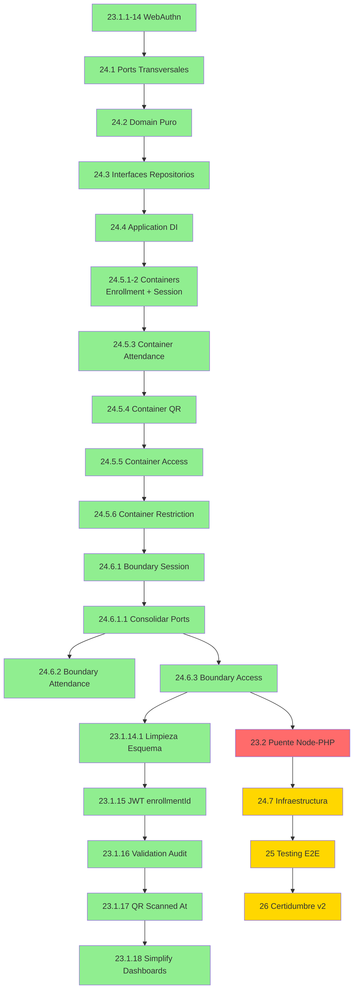

# ROADMAP - Sistema de Asistencia

> Versión: v24.6.3 | Última actualización: 2026-01-12

---

## Resumen de Estado

| Fase | Descripción | Estado | Impacto |
| ---- | ----------- | ------ | ------- |
| 23.1.1-14 | WebAuthn + Device Verification | COMPLETADA | SEGURIDAD |
| 23.1.14.1 | Limpieza Esquema: enrollment_id | COMPLETADA | MENOR |
| 23.1.15 | JWT enrollmentId Propagation | COMPLETADA | MENOR |
| 23.1.16 | Validation Audit Fields | COMPLETADA | MENOR |
| 23.1.17 | QR Scanned Timestamp | COMPLETADA | MENOR |
| 23.1.18 | Simplify PHP Dashboards | COMPLETADA | MENOR |
| 23.2 | Puente HTTP Node-PHP | PENDIENTE | MAYOR |
| 24.1.1-2 | Ports Transversales | COMPLETADA | CRÍTICO |
| 24.2.1-3 | Domain Puro | COMPLETADA | CRÍTICO |
| 24.3.1-5 | Interfaces Repositorios | COMPLETADA | MAYOR |
| 24.4.1-5 | Application DI | COMPLETADA | MAYOR |
| 24.5.1-2 | Containers (Enrollment, Session) | COMPLETADA | MAYOR |
| 24.5.3 | Container Attendance | COMPLETADA | MAYOR |
| 24.5.4 | Container QR Projection | COMPLETADA | MAYOR |
| 24.5.5 | Container Access | COMPLETADA | MAYOR |
| 24.5.6 | Container Restriction | COMPLETADA | MAYOR |
| 24.6.1 | Boundary Session → Enrollment | COMPLETADA | MENOR |
| 24.6.1.1 | Consolidación Shared Ports | COMPLETADA | MAYOR |
| 24.6.2 | Boundary Attendance → Otros | COMPLETADA | MAYOR |
| 24.6.3 | Boundary Access → Todos | COMPLETADA | MAYOR |
| 24.7 | Infraestructura y Operaciones | PENDIENTE | MAYOR |
| 25 | Testing E2E | PENDIENTE | MAYOR |
| 26 | Certidumbre v2 | PENDIENTE | MENOR |

---

## Orden de Ejecución

**Leyenda:** Verde = Completada | Rojo = Urgente (bloquea otras) | Amarillo = Pendiente

---

## Próxima Acción

### Pendientes (Por Prioridad de Ejecución)

| # | Fase | Objetivo | Esfuerzo | Bloqueado por |
| - | ---- | -------- | -------- | ------------- |
| 1 | 23.2 | Puente HTTP Node-PHP | 4-6h | — |
| 2 | 24.7 | Infraestructura y Operaciones | 4-8h | 23.2 |
| 3 | 25 | Testing E2E y Calidad | 8-16h | 24.7 |
| 4 | 26 | Sistema de Certidumbre v2 | 4-8h | 25 |

---

## Fases en Detalle

> Ver `.ignore/prompt/ACT-pln.md` para instrucciones completas de gestion de fases.
> **Resumen:** Al completar → actualizar Estado, Commit, DoD, Fases Completadas.
> Al agregar → numerar segun prioridad, actualizar diagrama y Proxima Accion.

---

### Fase 23.1.9: Rutas HTTP y Tipos de Violacion

**Objetivo:** Exponer endpoints HTTP para autenticacion WebAuthn y agregar nuevos tipos de violacion al dominio de restricciones.

**Rama:** `fase-23.1.9-auth-routes-violation-types`
**Modelo:** Sonnet
**Severidad:** MAYOR
**Referencia:** daRulez §2.2 (presentation layer), §7.1.1 (SoC)
**Estado:** COMPLETADA
**Commit:** 9fe04c1

**Situacion resuelta:**

- Endpoints `POST /api/session/authenticate/start` y `/verify` funcionales
- `ViolationType` extendido: `'cloned_device' | 'auth_failed'`
- AccessGateway soporta action `authenticate` en respuesta
- Frontend puede iniciar flujo WebAuthn desde estado `ENROLLED_NO_SESSION`

**Criterio de exito verificado:**

- [x] Endpoint `POST /api/session/authenticate/start` funciona
- [x] Endpoint `POST /api/session/authenticate/verify` funciona
- [x] `ViolationType` incluye `'cloned_device' | 'auth_failed'`
- [x] `npm run build` exitoso
- [x] Tests: 325/325 pasando

**Entregables completados:**

- `session/presentation/controllers/authenticate.controller.ts` - handlers start/verify
- `session/presentation/routes.ts` - rutas `/authenticate/*` agregadas
- `restriction/domain/models.ts` - ViolationType extendido (en fase 23.1.8)
- `access/application/services/access-gateway.service.ts` - action `authenticate` agregado

**Archivos creados:**

- `node-service/src/backend/session/presentation/controllers/authenticate.controller.ts`

**Archivos modificados:**

- `node-service/src/backend/session/presentation/routes.ts`
- `node-service/src/backend/restriction/domain/models.ts`
- `node-service/src/backend/access/application/services/access-gateway.service.ts`

**Tareas:**

- [x] Crear `AuthenticateController` con metodos start/verify
- [x] Registrar rutas en routes.ts
- [x] Agregar `'cloned_device' | 'auth_failed'` a ViolationType
- [x] Modificar AccessGateway para soportar action `authenticate`
- [x] Build y tests pasando
- [x] Probar endpoints manualmente

**Dependencias:** 23.1.8

**Referencias:** propuesta_autenticada.md secciones "Presentation" y "Nuevos Tipos de Violacion"

---

### Fase 23.1.10: Frontend WebAuthn Authentication

**Objetivo:** Implementar flujo de autenticacion WebAuthn en frontend, incluyendo nuevo metodo en LoginService y manejo del estado ENROLLED_NO_SESSION.

**Rama:** `fase-23.1.10-frontend-webauthn`
**Modelo:** Sonnet
**Severidad:** MAYOR
**Referencia:** daRulez §2.2 (frontend features), §7.1.1 (SoC)
**Estado:** COMPLETADA (2026-01-10)

**Situacion resuelta:**

- LoginService ahora tiene `authenticateWithWebAuthn()` con flujo ECDH completo
- qr-reader/main.ts maneja estado ENROLLED_NO_SESSION llamando autenticacion
- Integracion con `navigator.credentials.get()` para verificacion biometrica
- Race condition corregida: flag `isWebAuthnInProgress` previene prompts duplicados
- Flag `countdownCompleted` evita re-triggers tras countdown de penalty

**Criterio de exito verificado:**

- [x] Metodo `authenticateWithWebAuthn(credentialId)` existe en LoginService
- [x] Flujo en qr-reader/main.ts maneja `state === 'ENROLLED_NO_SESSION'`
- [x] Llama a `/api/session/authenticate/start` para obtener options
- [x] Ejecuta `navigator.credentials.get()` con options recibidas
- [x] Envia respuesta a `/api/session/authenticate/verify`
- [x] Recibe session_key y continua flujo normal
- [x] Test manual: Usuario enrollado puede autenticarse con biometria
- [x] `npm run build` exitoso

**Restricciones arquitectonicas:**

- Sigue patron existente de LoginService (daRulez §7.1.1)
- Reutiliza cliente HTTP existente
- No duplica logica de ECDH (se hace en backend tras verificacion)

**Entregables completados:**

- Metodo `authenticateWithWebAuthn()` en LoginService con ECDH client-side
- Modificacion de flujo en qr-reader/main.ts con race condition fix

**Archivos modificados:**

- `node-service/src/frontend/shared/services/login/login.service.ts` - Metodo `authenticateWithWebAuthn()`
- `node-service/src/frontend/features/qr-reader/main.ts` - Estado ENROLLED_NO_SESSION, flags anti-race

**Tareas:**

- [x] Agregar metodo `authenticateWithWebAuthn()` a LoginService
- [x] Implementar llamadas a endpoints `/authenticate/start` y `/authenticate/verify`
- [x] Integrar con `navigator.credentials.get()`
- [x] Modificar flujo en qr-reader para estado ENROLLED_NO_SESSION
- [x] Build pasando
- [x] Test manual end-to-end

**Dependencias:** 23.1.9

**Referencias:** propuesta_autenticada.md seccion "Frontend"

---

### Fase 23.1.14.1: Limpieza Esquema - enrollment_id + eliminar totps_valid

**Objetivo:** Renombrar `device_id` a `enrollment_id` en todo el sistema y eliminar columna huerfana `totps_valid`.

**Rama:** `fase-23.1.14.1-schema-cleanup`
**Modelo:** Sonnet
**Severidad:** MENOR
**Estado:** COMPLETADA

**Commit:** `10720fd` (fix: restaurar StartAuthenticationOutput con options)

**Diagnostico / Situacion:**

- **Actual:** Columna `device_id` sugiere "dispositivo fisico" pero representa "inscripcion WebAuthn".
- **Actual:** Columna `totps_valid` en `attendance.validations` nunca fue implementada (solo TOTPu existe).
- **Esperado:** Nomenclatura refleja semantica correcta: `enrollment_id` para FK a `enrollment.devices`.
- **Esperado:** Esquema limpio sin columnas huerfanas.

**Especificacion Tecnica:**

- **Scope DB (seed, NO migration):**
  - `database/migrations/001-seed.sql`: renombrar `device_id` a `enrollment_id` en tablas
  - `database/migrations/001-seed.sql`: eliminar columna `totps_valid` de `attendance.validations`
  
- **Scope TS (refactor nomenclatura):**
  - `enrollment/domain/`: `deviceId` a `enrollmentId` en DTOs y entidades
  - `enrollment/infrastructure/`: mapeo SQL `device_id` a `enrollment_id`
  - `attendance/domain/`: `deviceId` a `enrollmentId` en modelos
  - `attendance/infrastructure/`: mapeo SQL `device_id` a `enrollment_id`
  - `attendance/infrastructure/`: eliminar `totps_valid` de ValidationRowData
  - `auth/domain/`: `deviceId` a `enrollmentId` en JWTPayload
  - `session/domain/`: `deviceId` a `enrollmentId` en SessionData

- **Verificacion:**
  - Recrear volumen DB: `podman volume rm asistencia-postgres-data && podman-compose -f compose.dev.yaml up -d`
  - Tests: 352/352 pasando
  - Build: exitoso

**Tareas:**

- [x] Modificar 001-seed.sql: renombrar device_id, eliminar totps_valid
- [x] Refactor enrollment/: deviceId a enrollmentId
- [x] Refactor attendance/: deviceId a enrollmentId, eliminar totps_valid
- [x] Refactor auth/: deviceId a enrollmentId en JWT
- [x] Refactor session/: deviceId a enrollmentId en SessionData
- [x] Recrear volumen DB y verificar esquema
- [x] Tests pasando (352/352)
- [x] Build exitoso

**Dependencias:** 23.1.1-14 (WebAuthn completado)

**Bloquea:** 23.1.15, 23.1.16

---

### Fase 23.1.15: JWT enrollmentId Propagation + Explicit isActive

**Objetivo:** Propagar `enrollmentId` desde enrollment hasta `attendance.registrations` y hacer explicito `isActive` en creacion de dispositivos.

**Rama:** `fase-23.1.15-enrollment-id-propagation`
**Modelo:** Sonnet
**Severidad:** MENOR
**Estado:** COMPLETADA
**Commit:** `95fc548`

**Diagnostico / Situacion:**

- **Actual:** Campo `enrollment_id` en `attendance.registrations` queda NULL.
- **Actual:** `CreateDeviceDto` no incluye `isActive`, depende del DEFAULT de DB.
- **Esperado:** Node busca `enrollmentId` activo desde DeviceRepository y propaga hasta persistencia.
- **Esperado:** `isActive` es explicito desde logica de negocio, no implicito por DB.
- **SoC:** `enrollmentId` es responsabilidad de Node (WebAuthn), no de PHP (auth legacy).

**Especificacion Tecnica:**

- **Scope:**
  - `attendance/application/participation.service.ts` - buscar enrollmentId desde DeviceRepository
  - `attendance/attendance.container.ts` - inyectar DeviceRepository en ParticipationService
  - `enrollment/domain/entities/device.entity.ts` - agregar `isActive: boolean` a `CreateDeviceDto`
  - `enrollment/infrastructure/repositories/device.repository.ts` - incluir `is_active` en INSERT
  - `enrollment/application/use-cases/finish-enrollment.use-case.ts` - setear `isActive: true` explicito
- **Restricciones:**
  - No breaking change: si no hay dispositivos enrolados, enrollmentId queda NULL
  - Seleccionar dispositivo más reciente si existen múltiples activos
  - Logica de negocio determina `isActive`, DB solo persiste

**Criterio de Exito (DoD):**

- [x] `ParticipationService` recibe `IDeviceRepository` como dependencia
- [x] `ParticipationService` busca enrollmentId con `findByUserId()`
- [x] Selecciona dispositivo más reciente (lastUsedAt ?? enrolledAt)
- [x] `RegistrationRepository.create()` persiste `enrollment_id`
- [x] Registros nuevos tienen `enrollment_id` poblado (desde DeviceRepository)
- [x] Si no hay dispositivos, enrollmentId es NULL (no bloquea flujo)
- [x] `CreateDeviceDto` tiene `isActive: boolean` (mandatorio)
- [x] `FinishEnrollmentUseCase` setea `isActive: true` explicitamente
- [x] INSERT incluye `is_active` en la query
- [x] `npm run build` exitoso
- [x] Tests pasando (352/352)

**Dependencias:** 23.1.14.1 (Limpieza Esquema)

---

### Fase 23.1.16: Validation Audit Fields

**Objetivo:** Extraer y persistir campos de auditoría del pipeline de validación QR.

**Rama:** `fase-23.1.16-validation-audit-fields`
**Modelo:** Sonnet
**Severidad:** MENOR
**Estado:** COMPLETADA
**Commit:** `42c364c`
**Fecha:** 2026-01-12

**Diagnóstico / Situación:**

- **Actual:** Pipeline produce resultados por stage, pero `attendance-persistence.service.ts` no extrae ni persiste campos de auditoría. Campos `totpu_valid`, `totps_valid`, `rt_valid`, `secret_valid`, `qr_scanned_at` quedan NULL.
- **Esperado:** Campos derivados del resultado del pipeline y persistidos en cada validación.

**Especificación Técnica:**

- **Scope:**
  - `attendance/domain/validation-pipeline/context.ts` - agregar campos de auditoría explícitos
  - `attendance/domain/validation-pipeline/stages/*.ts` - setear campos en contexto
  - `attendance/application/services/attendance-persistence.service.ts` - extraer y pasar a repo
  - `attendance/domain/ports/validation-repository.interface.ts` - campos mandatorios en DTO
  - `attendance/infrastructure/validation.repository.ts` - ya soporta campos (verificar)

**Mapeo de campos:**

| Campo DB | Fuente | Stage |
| ---------- | -------- | ------- |
| `totpu_valid` | `ctx.audit.totpuValid` | `totp-validation.stage.ts` |
| `totps_valid` | `ctx.audit.totpsValid` | `totp-validation.stage.ts` (TOTPs) |
| `rt_valid` | Derivado de `responseTimeMs` vs threshold | `validate-scan.usecase.ts` |
| `secret_valid` | Si decrypt exitoso = true | `decrypt.stage.ts` |
| `qr_scanned_at` | Timestamp del request | Presentation layer |

**Restricciones:**

- Campos son **mandatorios** cuando validación completa (success/failed)
- Campos pueden ser null solo si validación es timeout (no hubo intento)
- No modificar estructura de stages existentes, solo agregar seteo de audit

**Criterio de Éxito (DoD):**

- [x] `ValidationContext` incluye `audit: AuditFields`
- [x] Stages setean campos de auditoría correspondientes
- [x] `CompleteValidationDTO` tiene campos opcionales (mandatorios excepto timeout)
- [x] `attendance-persistence.service.ts` extrae y pasa audit fields
- [x] Validaciones nuevas tienen campos de auditoría poblados
- [x] `npm run build` exitoso
- [x] Tests pasando (352/352)

**Dependencias:** 23.1.15 COMPLETADA

---

### Fase 23.1.17: QR Scanned Timestamp Propagation

**Objetivo:** Capturar y propagar timestamp de escaneo QR desde frontend hasta persistencia.

**Rama:** `fase-23.1.17-qr-scanned-at`
**Modelo:** Sonnet
**Severidad:** MENOR
**Estado:** COMPLETADA
**Commit:** `e64b311`
**Fecha:** 2026-01-12

**Diagnóstico / Situación:**

- **Actual:** Campo `qr_scanned_at` en `attendance.validations` queda NULL (0/4 registros). Frontend no envía timestamp de escaneo.
- **Esperado:** Frontend captura `Date.now()` al escanear QR, lo envía en request, y se persiste en cada validación.

**Especificación Técnica:**

- **Scope:**
  - `frontend/features/qr-reader/` - Capturar `scannedAt = Date.now()` al decodificar QR
  - `frontend/shared/services/` - Incluir `scannedAt` en body del POST `/scan`
  - `attendance/presentation/controllers/scan.controller.ts` - Extraer `scannedAt` del body
  - `attendance/application/complete-scan.usecase.ts` - Setear `ctx.audit.qrScannedAt`
  - `attendance/domain/validation-pipeline/context.ts` - Ya tiene campo definido
  - `attendance/infrastructure/validation.repository.ts` - Ya soporta persistencia

**Validación STD-arch.yaml:**

- Flujo: Frontend → Presentation → Application → Domain → Infrastructure
- Dependencias apuntan hacia Domain (correcto)
- No viola ninguna regla de capas

**Criterio de Éxito (DoD):**

- [x] Frontend captura timestamp al decodificar QR exitosamente
- [x] Request POST `/api/attendance/validate` incluye campo `scannedAt` en body
- [x] Controller extrae y propaga `scannedAt` al usecase
- [x] UseCase setea `ctx.audit.qrScannedAt` desde input
- [x] Nuevas validaciones tienen `qr_scanned_at` poblado en DB
- [x] `npm run build` exitoso
- [x] Tests pasando (352/352)

**Dependencias:** 23.1.16 COMPLETADA

---

### Fase 23.1.18: Simplify PHP Dashboards

**Objetivo:** Simplificar dashboards de Alumno y Profesor removiendo paneles mock y mostrando datos JWT enviados a Node.

**Rama:** `fase-23.1.18-simplify-dashboards`
**Modelo:** Sonnet
**Severidad:** MENOR
**Estado:** COMPLETADA
**Commit:** `4bfea3d`
**Fecha:** 2026-01-12

**Diagnóstico / Situación:**

- **Actual:** Dashboards muestran "Dashboard Alumno/Profesor" con paneles mock de sesiones y cursos.
- **Esperado:** Títulos simplificados ("Alumno"/"Profesor"), sin paneles mock, con panel mostrando datos JWT.

**Especificación Técnica:**

- **Scope:**
  - `php-service/src/dev-simulator/features/dashboard/alumno-dashboard.php`
  - `php-service/src/dev-simulator/features/dashboard/profesor-dashboard.php`
  
- **Cambios:**
  1. Cambiar título de "Dashboard Alumno" → "Alumno" (ídem Profesor)
  2. Eliminar paneles mock de sesiones activas y cursos
  3. Agregar panel estilo `attendance-result.php` mostrando datos JWT:
     - `idLegacy`, `run`, `nombre`, `rol`
  4. Mantener: botón logout, botón registrar asistencia

**Referencia:** `php-service/src/dev-simulator/features/qr-reader/attendance-result.php` (estilo de panel)

**Criterio de Éxito (DoD):**

- [x] Título simplificado en ambos dashboards
- [x] Paneles mock eliminados
- [x] Panel con datos JWT visibles (idLegacy, run, nombre, rol)
- [x] Botones de logout y registrar asistencia funcionando
- [x] Sin errores PHP

**Dependencias:** Ninguna (independiente)

---

### Fase 23.2: Puente HTTP Node-PHP

**Objetivo:** Establecer comunicacion bidireccional completa Node↔PHP: notificar asistencias, consultar datos maestros, health checks.

**Rama:** `fase-23.2-node-php-bridge`
**Modelo:** Opus
**Severidad:** MAYOR
**Estado:** PENDIENTE

**Dependencias:** 24.6.1, 24.6.2, 24.6.3 (Remediación arquitectónica completa)

---

### Fase 24.5.3: Container Attendance

**Objetivo:** Crear attendance.container.ts para centralizar la composición de dependencias del módulo Attendance.

**Rama:** `fase-24.5.3-container-attendance`
**Modelo:** Sonnet
**Severidad:** MAYOR (Refactor Arquitectónico)
**Referencia:** daRulez §2.2 (Segmentación Vertical), STD-arch.md §2 (Matriz de Interacción)
**Estado:** COMPLETADA (2026-01-11 22:10)
**Commit:** 98b356c

**Situación resuelta:**

- `attendance.container.ts` creado siguiendo patrón de `enrollment.container.ts`
- `routes.ts` refactorizado: eliminadas 12+ violaciones arquitectónicas (Presentation→Infrastructure)
- DI centralizado: 20+ dependencias organizadas en 3 niveles (infrastructure → services → use cases)
- Configuración opcional de persistencia PostgreSQL mediante env var

**Criterio de éxito verificado:**

- [x] `attendance.container.ts` creado con singleton exportado
- [x] `routes.ts` elimina imports de `/infrastructure/` (de 24 a 5 imports)
- [x] Sin instanciaciones directas (`new`) en presentation layer
- [x] Auditoría ACT-audit.md: **0 violaciones** (antes 12+ críticas)
- [x] Build exitoso en contenedor: `npm run build`
- [x] Tests: **92/92 pasando**

**Remediación arquitectónica:**

| Métrica | Antes | Después |
| --------- | ------- | --------- |
| Imports infrastructure | 12+ | 1 (logger compartido) |
| Instanciaciones directas | 15+ | 0 |
| Violaciones ACT-audit | CRÍTICAS | NINGUNA |
| Cumplimiento STD-arch.md | ❌ | ✅ |

**Entregables completados:**

- Container con 3 niveles de dependencias (infrastructure → application → use cases)
- Configuración flexible de persistencia (ENABLE_POSTGRES_PERSISTENCE)
- Factories para crypto services con session keys dinámicas
- Accessors públicos para repositorios usados directamente en rutas

**Archivos creados:**

- `node-service/src/backend/attendance/attendance.container.ts` (215 líneas)

**Archivos modificados:**

- `node-service/src/backend/attendance/presentation/routes.ts` (eliminadas 111 líneas de instanciaciones)

**Tareas:**

- [x] Analizar dependencias actuales en routes.ts
- [x] Crear container con 20+ dependencias inyectadas
- [x] Refactorizar routes.ts para obtener deps desde container
- [x] Eliminar parámetro `participationService?` de función routes
- [x] Auditar con ACT-audit.md (0 violaciones)
- [x] Build y tests pasando

**Dependencias:** 24.5.2 (Container Session)

**Referencias:** STD-arch.md §2 (Matriz de Interacción), enrollment.container.ts (patrón de referencia)

---

### Fase 24.5.4: Container QR Projection

**Objetivo:** Crear qr-projection.container.ts para centralizar la composición de dependencias del módulo QR Projection.

**Rama:** `fase-24.5.4-container-qr`
**Modelo:** Sonnet
**Severidad:** MAYOR (Refactor Arquitectónico)
**Referencia:** daRulez §2.2 (Segmentación Vertical), STD-arch.md §2 (Matriz de Interacción)
**Estado:** COMPLETADA (2026-01-11 22:25)
**Commit:** 64276f9

**Situación resuelta:**

- `qr-projection.container.ts` creado con factory pattern para inyección de dependencias externas
- `WebSocketController` refactorizado: `ActiveSessionRepository` inyectado vía constructor (eliminada instanciación directa)
- `app.ts` simplificado: usa `createQRProjectionContainer()` en lugar de DI manual de 7+ dependencias
- Imports limpiados: eliminados `ProjectionPoolRepository`, `ActiveSessionRepository`, `AesGcmService`, `PoolBalancer`, `QREmitter`, `QRPayloadRepository` de app.ts

**Criterio de éxito verificado:**

- [x] `qr-projection.container.ts` creado con factory exportada
- [x] Container instancia 10+ dependencias en 3 niveles (infrastructure → application → presentation)
- [x] `websocket-controller.ts` sin instanciaciones directas (`new ActiveSessionRepository()` eliminado)
- [x] `app.ts` refactorizado para usar container
- [x] Auditoría ACT-audit.md: **0 violaciones** (antes 2)
- [x] Build exitoso en contenedor: `npm run build`
- [x] Tests: **50/50 pasando**

**Remediación arquitectónica:**

| Métrica | Antes | Después |
| --------- | ------- | --------- |
| Imports concretos en presentation | 1 (ActiveSessionRepository) | 0 (solo tipo) |
| Instanciaciones directas | 1 (`new ActiveSessionRepository()`) | 0 |
| Violaciones ACT-audit | 2 CRÍTICAS | NINGUNA |
| Dependencias manuales en app.ts | 7+ instanciaciones | 1 factory call |
| Cumplimiento STD-arch.md | ❌ | ✅ |

**Patrón aplicado:**

- **Factory Pattern:** `createQRProjectionContainer()` acepta dependencias externas (authMiddleware, sessionCreator, config, logger)
- **3 niveles de DI:** Infrastructure → Application → Presentation
- **Configuración flexible:** Config inyectado, permite diferentes TTLs y pool sizes

**Entregables completados:**

- Container con factory para dependencias externas
- Instanciación de QRProjectionService con todas sus dependencias (PoolBalancer, QREmitter, PayloadRepo)
- WebSocketController recibe ActiveSessionRepository inyectado

**Archivos creados:**

- `node-service/src/backend/qr-projection/qr-projection.container.ts` (125 líneas)

**Archivos modificados:**

- `node-service/src/backend/qr-projection/presentation/websocket-controller.ts` (import cambiado a tipo, constructor actualizado)
- `node-service/src/app.ts` (eliminadas 35 líneas de DI manual, reemplazadas por 5 líneas con container)

**Tareas:**

- [x] Analizar dependencias de QRProjectionService y WebSocketController
- [x] Crear container con factory pattern
- [x] Inyectar ActiveSessionRepository en WebSocketController
- [x] Refactorizar app.ts para usar container
- [x] Limpiar imports no usados
- [x] Auditar con ACT-audit.md (0 violaciones)
- [x] Build y tests pasando

**Dependencias:** 24.5.3 (Container Attendance)

**Referencias:** STD-arch.md §2, attendance.container.ts (patrón similar pero sin factory)

---

### Fase 24.5.5: Container Access

**Objetivo:** Crear access.container.ts para centralizar composición de dependencias del módulo Access.
**Tipo:** REFACTOR | **Severidad:** MAYOR
**Rama:** `fase-24.5.5-container-access`
**Modelo:** Sonnet
**Estado:** COMPLETADA (2026-01-11 22:51)
**Commit:** `0d0d852`

**Situación resuelta:**

- `access.container.ts` creado con gestión cross-module (enrollment, session, restriction, auth)
- `routes.ts` simplificado: de 70+ líneas de instanciaciones a 3 líneas
- DI centralizado: dependencias de 4 módulos externos inyectadas
- Factory pattern con JWTConfig configurable

**Criterio de Éxito verificado:**

- [x] Container creado con factory `createAccessContainer()`
- [x] Routes sin instanciaciones directas
- [x] `npm run build` exitoso
- [x] Tests: 9/9 pasando

**Dependencias:** 24.4.2, 24.4.5

---

### Fase 24.5.6: Container Restriction

**Objetivo:** Crear restriction.container.ts para centralizar PenaltyRepository y RestrictionService.
**Tipo:** REFACTOR | **Severidad:** MAYOR
**Rama:** `fase-24.5.6-container-restriction`
**Modelo:** Sonnet
**Estado:** COMPLETADA (2026-01-11 23:05)
**Commit:** `2efa867`

**Situación resuelta:**

- `restriction.container.ts` creado con patrón singleton
- Exporta: restrictionService, restrictionQuery
- access.container.ts y enrollment.container.ts refactorizados para usar restriction container
- Elimina duplicación de instancias PostgresPool/ValkeyClient entre módulos

**Criterio de Éxito verificado:**

- [x] Container creado con singleton pattern
- [x] Factory `createRestrictionContainer()` con logger configurable
- [x] `npm run build` exitoso
- [x] Tests: 13/13 restriction, 139/139 enrollment, 9/9 access pasando

**Dependencias:** 24.4.5

**Dependencias:** 24.4.5

---

### Fase 24.6.1: Boundaries Session → Enrollment

**Objetivo:** Eliminar imports directos de session hacia enrollment/infrastructure.
**Tipo:** REFACTOR | **Severidad:** MENOR
**Rama:** `fase-24.6.1-boundary-session-enrollment`
**Modelo:** Sonnet
**Estado:** COMPLETADA
**Commit:** `54d1e4a`

**Situación resuelta:**

- Interfaces movidas a shared/ports: IDeviceRepository, IEcdhService, IHkdfService, IFido2Service, IPenaltyService
- SessionContainer recibe dependencias via constructor (inyección)
- Factory createSessionContainer() instancia implementaciones concretas (composición raíz)
- Patrón DI Container: imports de infraestructura solo en factory, no en lógica de negocio

**Criterio de Éxito verificado:**

- [x] SessionContainer usa interfaces de shared/ports
- [x] Dependencias inyectadas via constructor
- [x] `npm run build` exitoso
- [x] Tests: 101/101 pasando

**Nota arquitectónica:** Los imports de enrollment/infrastructure permanecen en la factory (createSessionContainer) que es el punto de composición. Esto es correcto según el patrón DI Container - la composición raíz puede conocer implementaciones concretas.

**Dependencias:** 24.5.1, 24.5.2

---

### Fase 24.6.1.1: Consolidación de Shared Ports (Fuente Única de Verdad)

**Objetivo:** Eliminar duplicación de interfaces cross-module y establecer fuente única de verdad en shared/ports/.

**Tipo:** REFACTOR | **Severidad:** MAYOR
**Rama:** `fase-24.6.1.1-consolidate-shared-ports`
**Modelo:** Sonnet
**Estado:** COMPLETADA
**Commit:** ba96e1e

**Situación resuelta:**

- `shared/ports/enrollment-crypto.port.ts` ahora re-exporta desde `enrollment/domain/ports/`
- `shared/ports/device-repository.port.ts` ahora re-exporta desde `enrollment/domain/ports/`
- `shared/ports/session-query.port.ts` creado (migrado desde `backend/shared/ports/`)
- `backend/shared/ports/` marcado como deprecado (solo re-exports)
- session/application y attendance/application usan `shared/ports`
- `fido2-service.interface.ts` actualizado con métodos de autenticación

**Criterio de Éxito (DoD):**

- [x] `shared/ports/enrollment-crypto.port.ts` solo contiene re-exports
- [x] `shared/ports/device-repository.port.ts` solo contiene re-export
- [x] `src/backend/shared/ports/` marcado deprecado (re-exports a canónico)
- [x] session/application NO importa desde `enrollment/domain/ports`
- [x] attendance/application NO importa desde `enrollment/domain/ports`
- [x] `npm run build` exitoso
- [x] Tests existentes pasando (352/352)

**Dependencias:** 24.6.1 (corrección de implementación)

---

### Fase 24.6.2: Boundaries Attendance → Otros

**Objetivo:** Eliminar imports de attendance hacia enrollment/session infrastructure.
**Tipo:** REFACTOR | **Severidad:** MAYOR
**Rama:** `fase-24.6.2-boundary-attendance`
**Modelo:** Sonnet
**Estado:** COMPLETADA
**Commit:** d4339b8

**Situación resuelta:**

- `shared/ports/session-key-repository.port.ts` creado (re-export ISessionKeyRepository)
- `shared/ports/totp-validator.port.ts` creado (re-export ITotpValidator)
- `session-key-query.adapter.ts` refactorizado: recibe ISessionKeyRepository via constructor
- `complete-scan-deps.factory.ts` refactorizado: recibe FactoryDependencies inyectadas
- `attendance.container.ts` actualizado: instancia concretos y los pasa al factory
- 4 violaciones CRITICAL eliminadas

**Criterio de Éxito (DoD):**

- [x] `grep -r "session/infrastructure" attendance/` → solo en *.container.ts
- [x] `grep -r "enrollment/infrastructure" attendance/` → solo en *.container.ts
- [x] ACT-audit scan #4 pasa sin violaciones en attendance/
- [x] `npm run build` exitoso
- [x] Tests pasando (352/352)

**Dependencias:** 24.6.1.1 (shared ports consolidados)

---

### Fase 24.6.3: Boundaries Access → Todos

**Objetivo:** Access Gateway usa solo interfaces compartidas.
**Tipo:** REFACTOR | **Severidad:** MAYOR
**Rama:** `fase-24.6.3-boundary-access`
**Modelo:** Sonnet
**Estado:** COMPLETADA
**Commit:** aa72d40

**Diagnóstico / Situación (Auditoría 2026-01-12):**

| Archivo | Violación | Import Ilegal |
| --------- | ----------- | --------------- |
| `application/services/access-gateway.service.ts` | cross_module | `EnrollmentFlowOrchestrator` from enrollment/application |

- **Actual:** 1 violación CRITICAL en application/services
- **Nota:** Imports en `access.container.ts` están exceptuados (Composition Root)
- **Esperado:** AccessGatewayService recibe orquestador via interfaz en shared/ports

**Especificación Técnica:**

- **Scope:**
  - Crear `shared/ports/enrollment-orchestrator.port.ts` con interfaz `IEnrollmentOrchestrator`
  - `EnrollmentFlowOrchestrator` implementa `IEnrollmentOrchestrator`
  - `AccessGatewayService` recibe `IEnrollmentOrchestrator` en constructor
  - Actualizar `access.container.ts` para inyectar concreto

- **Restricciones:**
  - ACT-audit.yaml scan #4: No imports cross-module excepto shared/ports y *.container.ts
  - Mantener API pública de AccessGatewayService

**Criterio de Éxito (DoD):**

- [x] `grep -r "enrollment/" access/application/` → 0 resultados
- [x] ACT-audit scan #4 pasa sin violaciones en access/
- [x] `npm run build` exitoso
- [x] Tests pasando (352/352)

**Dependencias:** 24.6.1.1 (shared ports consolidados)

---

### Fase 24.7: Infraestructura y Operaciones

**Objetivo:** Preparar sistema para produccion: gestion de secretos, monitoreo, procedimientos de recuperacion.

**Modelo:** Opus
**Severidad:** MAYOR

**Dependencias:** Requiere 24.6.1, 24.6.2, 24.6.3

---

### Fase 25: Testing E2E y Calidad

**Objetivo:** Validar flujos completos end-to-end, medir rendimiento bajo carga, auditoria de seguridad.

**Modelo:** Opus
**Severidad:** MAYOR

**Dependencias:** Requiere 24.7

---

### Fase 26: Sistema de Certidumbre Mejorado

**Objetivo:** Reemplazar algoritmo de certidumbre actual (avg/stdDev) por sistema multi-factor extensible.

**Rama:** `fase-26-certainty-v2`
**Modelo:** Opus
**Severidad:** MENOR

**Modelo propuesto (10 factores, 4 categorias):**

| Categoria | Peso | Factores |
| --------- | ---- | -------- |
| Timing | 40% | ResponseTimeConsistency, Range, Trend, MedianDev |
| Device | 25% | DeviceConsistency, SessionKeyFreshness |
| Behavior | 20% | CompletionRate, AttemptEfficiency |
| Fraud | 15% | FraudHistory, SessionConcurrency |

**Dependencias:** Recomendado despues de Fase 25

---

## Fases Completadas

> Formato: `**X.Y.Z** — Titulo (commit)` | ~~Tachado~~ = descartada

- **23.1.1-3** — PHP Integration + Vertical Slice
- **23.1.4-8** — WebAuthn Backend (Ports, SignCount, Challenge, Adapter, UseCases)
- **23.1.9** — Rutas HTTP + ViolationType (`9fe04c1`)
- **23.1.10** — Frontend WebAuthn
- **23.1.11** — Module-Level Instance
- ~~**23.1.12**~~ — Session Revocation (DESCARTADA)
- **23.1.13** — Device Verification / Proof of Possession (`9626b21`)
- **23.1.14** — IP Capture + Stability (`3636b80`)
- **24.1.1** — Port ILogger
- **24.1.2** — Port ICryptoService
- **24.2.1** — Domain Puro - Attendance Pipeline
- **24.2.2** — Domain Puro - QR Generator
- **24.2.3** — Domain Puro - AAGUID
- **24.3.1** — Interfaces Repositorios Enrollment (`030fbfb`)
- **24.3.2** — Interfaces Repositorios Session (`fdb9481`)
- **24.3.3** — Interfaces Repositorios Attendance (`7ce1637`)
- **24.3.4** — Interfaces Repositorios Restriction (`6ba26db`)
- **24.3.5** — Interfaces Repositorios Shared/Valkey (`4ffe826`)
- **24.4.1** — Application DI - Enrollment (`d81187c`)
- **24.4.2** — Application DI - Session (`8d5f21b`)
- **24.4.3** — Application DI - Attendance (`89b07e4`)
- **24.4.4** — Application DI - QR Projection (`d5c195e`)
- **24.4.5** — Application DI - Restriction (`4a6c6c5`)
- **24.5.1** — Container Enrollment (`b2ca0d1`)
- **24.5.2** — Container Session (`196dc9f`)
- **24.5.3** — Container Attendance (`98b356c`)
- **24.5.4** — Container QR Projection (`64276f9`)
- **24.5.5** — Container Access (`0d0d852`)
- **24.5.6** — Container Restriction (`2efa867`)
- **24.6.1** — Boundary Session → Enrollment (`54d1e4a`)

---

## Política de Selección de Modelo IA

| Severidad | Modelo | Cuándo |
| --------- | ------ | ------ |
| CRÍTICO | Opus | Decisiones arquitectónicas, seguridad, integraciones complejas |
| MAYOR | Sonnet | Features, refactors de scope medio |
| MENOR | Sonnet | Bug fixes, cambios simples |

---

*Fuente de verdad para tareas del proyecto. Actualizado automáticamente al completar fases.*
