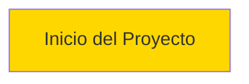

# ROADMAP - Sistema de Mapa Interactivo

> Versión: v1.0.0 | Última actualización: 2026-01-30

---

## Resumen de Estado

| Fase | Descripción | Estado | Impacto |
| ---- | ----------- | ------ | ------- |
| — | — | — | — |

---

## Orden de Ejecución

**Leyenda:** Verde = Completada | Rojo = Urgente (bloquea otras) | Amarillo = Pendiente

---

## Próxima Acción

### Pendientes (Por Prioridad de Ejecución)

| # | Fase | Objetivo | Esfuerzo | Bloqueado por |
| - | ---- | -------- | -------- | ------------- |
| — | — | — | — | — |

---

## Fases en Detalle

> Ver `ToolBox/prompt/ACT-pln.md` para instrucciones completas de gestión de fases.
> **Resumen:** Al completar → actualizar Estado, Commit, DoD, Fases Completadas.
> Al agregar → numerar según prioridad, actualizar diagrama y Próxima Acción.

---

### Fase X.Y: [Título de la Fase]

**Objetivo:** [Descripción breve del objetivo]

**Rama:** `fase-x.y-nombre-descriptivo`
**Modelo:** Sonnet | Opus
**Severidad:** CRÍTICO | MAYOR | MENOR
**Referencia:** [Referencias a documentación relevante]
**Estado:** PENDIENTE | EN PROGRESO | COMPLETADA
**Commit:** —

**Diagnóstico / Situación:**

- **Actual:** [Descripción del estado actual]
- **Esperado:** [Descripción del estado esperado]

**Especificación Técnica:**

- **Scope:**
  - [Archivos o módulos afectados]

**Criterio de Éxito (DoD):**

- [ ] [Criterio 1]
- [ ] [Criterio 2]
- [ ] `npm run build` exitoso (backend)
- [ ] `npm run build` exitoso (frontend)
- [ ] Tests pasando

**Entregables:**

- [Lista de archivos a crear/modificar]

**Tareas:**

- [ ] [Tarea 1]
- [ ] [Tarea 2]

**Dependencias:** [Fases previas requeridas o "Ninguna"]

**Referencias:** [Documentación, issues, PRs relacionados]

---

## Fases Completadas

> Formato: `**X.Y.Z** — Título (commit)` | ~~Tachado~~ = descartada

- —

---

## Política de Selección de Modelo IA

| Severidad | Modelo | Cuándo |
| --------- | ------ | ------ |
| CRÍTICO | Opus | Decisiones arquitectónicas, seguridad, integraciones complejas |
| MAYOR | Sonnet | Features, refactors de scope medio |
| MENOR | Sonnet | Bug fixes, cambios simples |

---

*Fuente de verdad para tareas del proyecto. Actualizado automáticamente al completar fases.*
