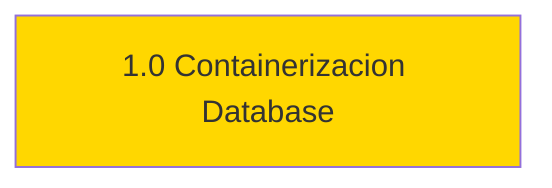

# ROADMAP - Sistema de Mapa Interactivo

> Versión: v1.0.0 | Última actualización: 2026-01-30

---

## Resumen de Estado

| Fase | Descripcion | Estado | Impacto |
| ---- | ----------- | ------ | ------- |
| 1.0 | Containerizacion y separacion database | EN PROGRESO | MAJOR |

---

## Orden de Ejecución

**Leyenda:** Verde = Completada | Rojo = Urgente (bloquea otras) | Amarillo = Pendiente

---

## Próxima Acción

### Pendientes (Por Prioridad de Ejecucion)

| # | Fase | Objetivo | Esfuerzo | Bloqueado por |
| - | ---- | -------- | -------- | ------------- |
| 1 | 1.0 | Separar database y containerizar con Podman | Medio | Ninguno |

---

## Fases en Detalle

> Ver `ToolBox/prompt/ACT-pln.md` para instrucciones completas de gestion de fases.
> **Resumen:** Al completar -> actualizar Estado, Commit, DoD, Fases Completadas.
> Al agregar -> numerar segun prioridad, actualizar diagrama y Proxima Accion.

---

### Fase 1.0: Containerizacion y Separacion de Database

**Objetivo:** Refactorizar topologia del proyecto separando database de backend y containerizando con Podman

**Rama:** `fase-1.0-containerizacion-database`
**Modelo:** Opus
**Severidad:** MAJOR
**Referencia:** daRulez.md seccion 2.2 Topologia
**Estado:** EN PROGRESO
**Commit:** ---

**Diagnostico / Situacion:**

- **Actual:** Archivos SQL mezclados en backend/, sin containerizacion
- **Esperado:** Topologia separada con database/, Containerfiles, compose.yaml

**Especificacion Tecnica:**

- **Scope:**
  - `/database/` - Nueva topologia
  - `/backend/Containerfile` - Containerizacion backend
  - `/frontend/Containerfile` - Containerizacion frontend
  - `/compose.yaml` - Orquestacion base
  - `/compose.dev.yaml` - Override desarrollo
  - `/compose.prod.yaml` - Override produccion
  - `/.env.example` - Variables de entorno

**Criterio de Exito (DoD):**

- [x] Crear topologia database/ con migrations/, seeds/, init.sql
- [x] Mover archivos SQL de backend/ a database/
- [x] Crear backend/Containerfile
- [x] Crear frontend/Containerfile
- [x] Crear compose.yaml base
- [x] Crear compose.dev.yaml y compose.prod.yaml
- [x] Crear .env.example
- [x] Verificar podman compose config
- [x] Verificar podman compose build

**Entregables:**

- database/init.sql
- database/migrations/001_schema.sql
- database/seeds/001_data.sql
- backend/Containerfile
- frontend/Containerfile
- compose.yaml
- compose.dev.yaml
- compose.prod.yaml
- .env.example

**Tareas:**

- [x] Crear estructura database/
- [x] Mover archivos SQL existentes
- [x] Crear Containerfiles
- [x] Crear archivos compose
- [x] Verificar con podman

**Dependencias:** Ninguna

**Referencias:** daRulez.md, STD-arch.yaml, ACT-xec.yaml

---

### Fase X.Y: [Titulo de la Fase]

**Objetivo:** [Descripción breve del objetivo]

**Rama:** `fase-x.y-nombre-descriptivo`
**Modelo:** Sonnet | Opus
**Severidad:** CRÍTICO | MAYOR | MENOR
**Referencia:** [Referencias a documentación relevante]
**Estado:** PENDIENTE | EN PROGRESO | COMPLETADA
**Commit:** —

**Diagnóstico / Situación:**

- **Actual:** [Descripción del estado actual]
- **Esperado:** [Descripción del estado esperado]

**Especificación Técnica:**

- **Scope:**
  - [Archivos o módulos afectados]

**Criterio de Éxito (DoD):**

- [ ] [Criterio 1]
- [ ] [Criterio 2]
- [ ] `npm run build` exitoso (backend)
- [ ] `npm run build` exitoso (frontend)
- [ ] Tests pasando

**Entregables:**

- [Lista de archivos a crear/modificar]

**Tareas:**

- [ ] [Tarea 1]
- [ ] [Tarea 2]

**Dependencias:** [Fases previas requeridas o "Ninguna"]

**Referencias:** [Documentación, issues, PRs relacionados]

---

## Fases Completadas

> Formato: `**X.Y.Z** — Título (commit)` | ~~Tachado~~ = descartada

- —

---

## Política de Selección de Modelo IA

| Severidad | Modelo | Cuándo |
| --------- | ------ | ------ |
| CRÍTICO | Opus | Decisiones arquitectónicas, seguridad, integraciones complejas |
| MAYOR | Sonnet | Features, refactors de scope medio |
| MENOR | Sonnet | Bug fixes, cambios simples |

---

*Fuente de verdad para tareas del proyecto. Actualizado automáticamente al completar fases.*
