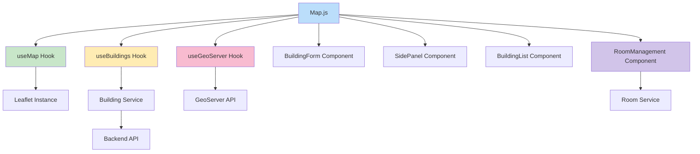

# 🗺️ InteractiveMapUCN - Análisis de Arquitectura

## 📋 Resumen Ejecutivo

**InteractiveMapUCN** es una aplicación web React que integra mapas interactivos (Leaflet) con gestión de datos geoespaciales, permitiendo la administración de edificios y salas de la Universidad Católica del Norte, sede Coquimbo.

---

## 🏗️ Diagrama de Arquitectura



---

## 🎯 Componentes Principales

### 🗺️ **Map.js** - Componente Central
**Responsabilidades:**
- ✅ Coordinación global de la aplicación
- ✅ Integración de hooks y servicios
- ✅ Gestión de estados de UI
- ✅ Renderizado de elementos en el mapa

**Estados Gestionados:**
```javascript
showBuildingForm, showBuildingList, showRoomManagement
coordinateDetection, tempMarker, capturedCoords
editingBuilding, selectedBuildingForRooms
roomManagementMode, selectedRooms
```

---

## 🔧 Custom Hooks

### 🗺️ **useMap.js**
```javascript
// Gestión del mapa Leaflet
- Inicialización y configuración del mapa
- Control de zoom y límites geográficos
- Manejo de eventos del mapa
- Estados: isMapReady, mapInstance
```

### 🏢 **useBuildings.js**
```javascript
// Gestión de estado de edificios
- Carga y sincronización de edificios
- Conexión con backend mediante buildingService
- Manejo de estados de loading y error
- Estados: buildings[], loading, error, backendStatus
```

### 🌐 **useGeoServer.js**
```javascript
// Integración con GeoServer
- Carga de datos WFS (Web Feature Service)
- Procesamiento de features GeoJSON
- Renderizado de capas en el mapa
- Estados: status, features[]
```

---

## 🔌 Servicios de API

### 🏢 **buildingService.js**
```javascript
// Interfaz con backend para edificios
- getAllBuildings()    // ✅ Incluye salas
- createBuilding()
- updateBuilding()
- deleteBuilding()
- syncWithGeoServer()
- checkHealth()
```

### 🚪 **roomService.js**
```javascript
// Gestión de salas por edificio
- createRooms()        // Creación múltiple
- getRoomsByBuilding()
- updateRoom()
- deleteRoom()
```

### 🌐 **api.js**
```javascript
// Cliente HTTP genérico
- get(endpoint)
- post(endpoint, data)
- put(endpoint, data)    // ✅ Agregado recientemente
- delete(endpoint)
```

---

## 🎨 Componentes de UI

### 📋 **BuildingForm.js**
- Formulario modal para crear/editar edificios
- Tipos de edificio con emojis y colores
- Validación de coordenadas
- Integración con captura interactiva

### 🎛️ **SidePanel.jsx**
- Menú principal con dropdowns
- Navegación entre funcionalidades
- Estado del sistema y contadores
- Botones de acción principales

### 📝 **BuildingList Component**
- Lista y gestión de edificios existentes
- Acciones: editar, eliminar, gestionar salas
- Integración con RoomManagement

### 🚪 **RoomManagement Component**
- Creación y edición de salas
- Asignación a edificios específicos
- Gestión de múltiples salas simultáneamente

---

## ⚙️ Configuraciones Técnicas

### 🗺️ **mapConfig.js**
```javascript
export const UCN_COQUIMBO_BOUNDS = [
  [-29.96800, -71.35650], // Suroeste
  [-29.96200, -71.34850]  // Noreste
];

export const MAP_ZOOM_LIMITS = {
  min: 17,    // Muy cercano
  max: 19,    // Extremadamente cercano  
  default: 18 // Nivel de detalle alto
};

export const GEO_SERVER_CONFIG = {
  baseUrl: 'http://localhost:8080/geoserver',
  workspace: 'InteractiveMap',
  layerName: 'edificio'
};
```

### 🎨 **Sistema de Íconos**
- **Edificios de BD**: Ícono morado (`#6a27aeff`)
- **Coordenadas temporales**: Ícono rojo (`#e74c3c`)
- **GeoServer**: Íconos basados en tipo (🏛️, 🏢, 🔬, 📚)

---

## 🚀 Funcionalidades Implementadas

### ✅ **Gestión de Edificios**
- Crear, editar, eliminar edificios
- Captura interactiva de coordenadas
- Sincronización con GeoServer
- Renderizado en mapa con íconos personalizados

### ✅ **Gestión de Salas**
- Creación múltiple de salas por edificio
- Asignación de pisos y características
- Integración jerárquica (edificio → salas)
- Operaciones CRUD completas

### ✅ **Interfaz de Usuario**
- SidePanel con menús desplegables
- Formularios modales para edificios y salas
- Listas de gestión con acciones contextuales
- Feedback visual de estados (loading, error, éxito)

### ✅ **Integración GeoServer**
- Carga de datos WFS
- Procesamiento de GeoJSON
- Sincronización bidireccional
- Visualización de capas

---

## 📊 Flujos de Datos

### 🔄 **Carga Inicial**
```
App → Map → useBuildings → buildingService → Backend API
```

### 🗺️ **Renderizado Mapa**
```
Map → useMap → Leaflet → TileLayer + Markers
```

### 🔄 **Sincronización GeoServer**
```
Map → useGeoServer → WFS → GeoJSON → Capas Mapa
```

### 🏢 **Gestión Edificios**
```
BuildingForm → Map → useBuildings → buildingService → Backend
```

### 🚪 **Gestión Salas**
```
RoomManagement → roomService → Backend → Actualización useBuildings
```

---

## 🎯 Puntos Fuertes Identificados

1. **✅ Arquitectura modular** - Separación clara de responsabilidades
2. **✅ Manejo de estado robusto** - Hooks personalizados para cada dominio
3. **✅ UX mejorada** - Captura interactiva de coordenadas, feedback visual
4. **✅ Integración múltiple** - Backend + GeoServer + Frontend
5. **✅ Escalabilidad** - Estructura preparada para nuevas funcionalidades

---

## 🔮 Recomendaciones de Mejora

1. **🔧 Centralizar configuración** - Variables de entorno para URLs
2. **🛡️ Manejo de errores** - Sistema más robusto con reintentos
3. **🧪 Testing** - Implementar tests para hooks y servicios
4. **⚡ Performance** - Memoización de componentes pesados
5. **📚 Documentación** - Comentarios JSDoc para funciones complejas

---

## 📈 Estado del Proyecto

**Estado:** 🟢 **Funcional y Estable**

La aplicación demuestra una **arquitectura sólida y bien estructurada** con una clara separación de preocupaciones y una integración efectiva entre el frontend React, el backend y los servicios geoespaciales de GeoServer.

**Última Actualización:** Implementación completa de gestión de salas integrada con edificios.