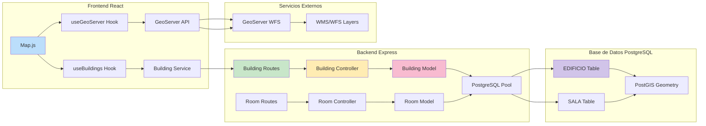
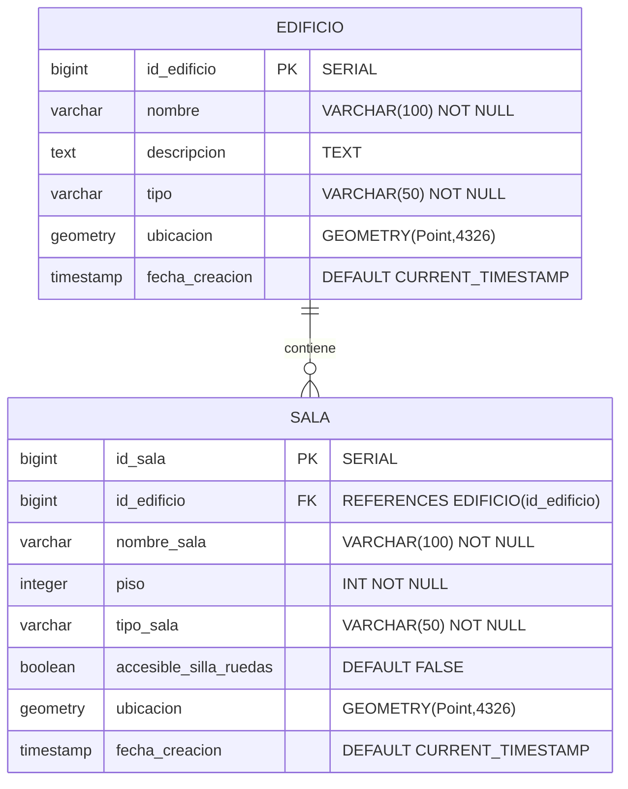

# 🏗️ InteractiveMapUCN - Análisis de Backend y Base de Datos

## 📊 Diagrama de Arquitectura Completa



---

## 🗃️ Esquema de Base de Datos



---

## 🚀 API Endpoints Implementados

### **🏢 Edificios** (`/api/buildings`)
| Método | Endpoint | Descripción |
|--------|----------|-------------|
| `GET` | `/` | Obtener todos los edificios **CON salas** |
| `POST` | `/` | Crear nuevo edificio |
| `PUT` | `/:id` | Actualizar edificio existente |
| `DELETE` | `/:id` | Eliminar edificio permanentemente |
| `POST` | `/sync` | Sincronizar con GeoServer |

### **🚪 Salas** (`/api/rooms`)
| Método | Endpoint | Descripción |
|--------|----------|-------------|
| `POST` | `/` | Crear **múltiples** salas |
| `GET` | `/building/:buildingId` | Obtener salas por edificio |
| `PUT` | `/:id` | Actualizar sala específica |
| `DELETE` | `/:id` | Eliminar sala |

---

## 🔧 Características Técnicas del Backend

### **🗃️ Modelos de Datos**

#### **Building Model** (`buildingModel.js`)
```javascript
// Consulta principal con JOIN de salas
const query = `
  SELECT 
    e.id_edificio as id,
    e.nombre,
    e.descripcion,
    e.tipo,
    ST_AsGeoJSON(e.ubicacion) as ubicacion_geojson,
    COALESCE(
      json_agg(salas) FILTER (WHERE salas.id_sala IS NOT NULL),
      '[]'
    ) as salas
  FROM edificio e
  LEFT JOIN sala s ON e.id_edificio = s.id_edificio
  GROUP BY e.id_edificio
`;
```

**Características:**
- ✅ **JOIN automático** con tabla de salas
- ✅ **GeoJSON** para datos espaciales
- ✅ **Manejo de IDs** con búsqueda de huecos
- ✅ **Transacciones** para operaciones críticas
- ✅ **Fallback** para consultas fallidas

#### **Room Model** (`roomModel.js`)
```javascript
// Inserción con PostGIS
const query = `
  INSERT INTO sala (
    id_sala, id_edificio, nombre_sala, piso, tipo_sala,
    accesible_silla_ruedas, ubicacion
  ) VALUES ($1, $2, $3, $4, $5, $6, ST_SetSRID(ST_MakePoint($7, $8), 4326))
`;
```

**Características:**
- ✅ **Creación múltiple** en transacción
- ✅ **PostGIS** para coordenadas espaciales
- ✅ **Validación** de coordenadas numéricas
- ✅ **Funciones espaciales** avanzadas

---

## 🗄️ Configuración de Base de Datos

### **PostgreSQL Connection** (`database.js`)
```javascript
const pool = new Pool({
  host: process.env.DB_HOST || 'localhost',
  port: process.env.DB_PORT || 5433,  // Puerto personalizado
  database: process.env.DB_NAME,
  user: process.env.DB_USER,
  password: process.env.DB_PASSWORD
});
```

### **PostGIS Integration**
- **SRID 4326**: Sistema de coordenadas WGS84
- **Geometry Types**: `Point` para ubicaciones
- **Spatial Functions**: `ST_AsGeoJSON`, `ST_MakePoint`, `ST_Distance`

---

## 🎯 Controladores Especializados

### **Buildings Controller** (`buildingsController.js`)
```javascript
// Transformación de datos para frontend
const ubicacion = {
  type: 'Point',
  coordinates: [parseFloat(lng), parseFloat(lat)]
};
```

**Validaciones:**
- ✅ Campos requeridos: `nombre`, `lat`, `lng`
- ✅ Transformación a GeoJSON
- ✅ Manejo de errores estructurado

### **Rooms Controller** (`roomsController.js`)
```javascript
// Validación robusta de coordenadas
if (isNaN(parseFloat(room.longitud)) || isNaN(parseFloat(room.latitud))) {
  return res.status(400).json({
    success: false,
    message: 'Las coordenadas deben ser números válidos'
  });
}
```

---

## 🔄 Flujos de Datos Complejos

### **Carga de Edificios con Salas**
```
Frontend → BuildingService → GET /api/buildings → 
BuildingController → BuildingModel.getAll() → 
PostgreSQL JOIN → Transformación GeoJSON → 
Response con Array de Salas
```

### **Creación de Múltiples Salas**
```
RoomManagement → roomService.createRooms() → 
POST /api/rooms → RoomsController → 
RoomModel.createRooms() → Transacción PostgreSQL → 
Confirmación múltiple
```

### **Sincronización GeoServer**
```
useGeoServer Hook → WFS Data → 
POST /api/buildings/sync → 
BuildingController.syncWithGeoServer()
```

---

## 🛡️ Manejo de Errores

### **Error Handler Centralizado** (`errorHandler.js`)
```javascript
res.status(500).json({
  success: false,
  message: 'Error interno del servidor',
  error: process.env.NODE_ENV === 'development' ? err.message : {}
});
```

### **Estrategias de Resiliencia**
1. **Fallback en consultas**: Si falla JOIN, devolver edificios sin salas
2. **Validación de coordenadas**: Prevenir datos espaciales corruptos
3. **Manejo de transacciones**: Rollback en operaciones múltiples
4. **Logging detallado**: Debugging en desarrollo y producción

---

## 📈 Características Avanzadas

### **Gestión de IDs Inteligente**
```javascript
// Encuentra huecos en la secuencia de IDs
WITH numbered_ids AS (
  SELECT id_edificio, LAG(id_edificio) OVER (ORDER BY id_edificio) as prev_id
  FROM edificio
)
SELECT COALESCE(
  (SELECT prev_id + 1 FROM numbered_ids WHERE id_edificio - prev_id > 1 LIMIT 1),
  (SELECT COALESCE(MAX(id_edificio), 0) + 1 FROM edificio)
) as available_id
```

### **Consultas Espaciales PostGIS**
```javascript
// Encontrar salas cercanas
ST_Distance(
  ubicacion, 
  ST_SetSRID(ST_MakePoint($1, $2), 4326)::geography
) as distancia_metros
```

---

## 🎉 Estado del Backend

### **✅ Completamente Implementado**
- **CRUD Completo** para edificios y salas
- **API REST** bien estructurada
- **Integración PostGIS** funcional
- **Manejo de errores** robusto
- **Validaciones** de datos

### **🚀 Listo para Producción**
- **Transacciones** para consistencia de datos
- **Logging** detallado para debugging
- **Configuración** mediante variables de entorno
- **Escalabilidad** con conexiones pool

---

## 🔮 Próximos Pasos Recomendados

1. **🔐 Autenticación**: Integrar tabla `ADMINISTRADOR`
2. **🗺️ Rutas**: Implementar tablas `RUTA` y `PUNTO_RUTA`
3. **📐 Planos**: Agregar gestión de `PLANO`
4. **🧪 Testing**: Tests unitarios e integración
5. **📊 Monitoring**: Métricas y health checks

El backend demuestra una **arquitectura sólida y escalable** con una excelente integración de datos espaciales y una API bien diseñada para soportar las necesidades del frontend React.