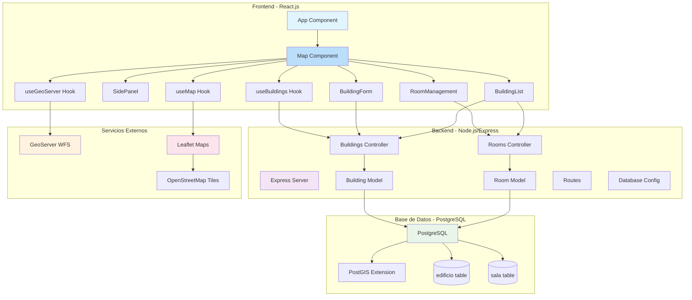
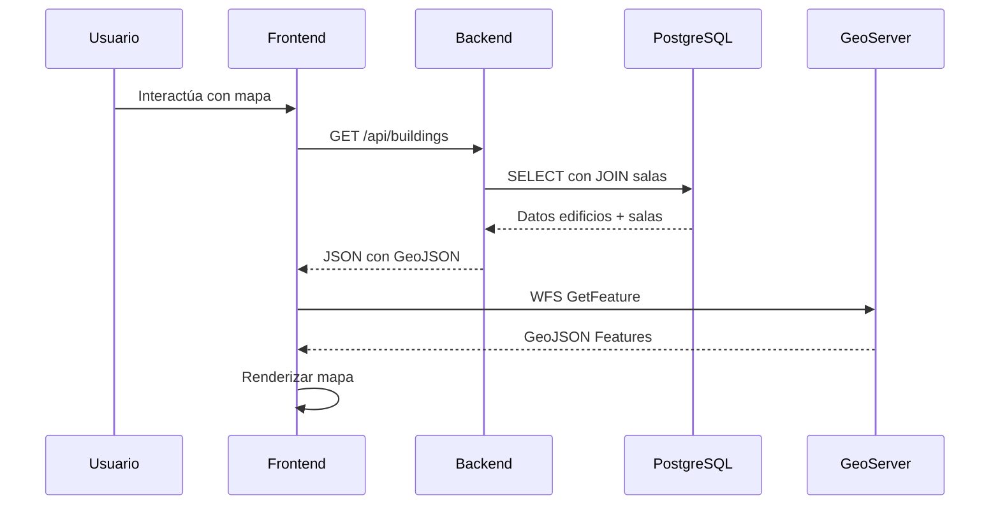

# 🏗️ InteractiveMapUCN - Arquitectura Completa del Sistema

## 📊 Diagrama de Arquitectura General



---

## 🎯 Componentes de la Arquitectura

### **🌐 Frontend - React.js**
| Componente | Tecnología | Responsabilidad |
|------------|------------|-----------------|
| **App Component** | React | Componente raíz, configuración general |
| **Map Component** | React + Leaflet | Mapa interactivo, coordinación general |
| **BuildingForm** | React | Formulario crear/editar edificios |
| **SidePanel** | React | Panel de navegación y controles |
| **RoomManagement** | React | Gestión de salas por edificio |
| **BuildingList** | React | Lista y gestión de edificios |
| **useBuildings Hook** | React Hooks | Estado y lógica de edificios |
| **useMap Hook** | React Hooks | Gestión del mapa Leaflet |
| **useGeoServer Hook** | React Hooks | Integración con GeoServer |

### **⚙️ Backend - Node.js/Express**
| Componente | Tecnología | Responsabilidad |
|------------|------------|-----------------|
| **Express Server** | Express.js | Servidor HTTP, middleware |
| **Buildings Controller** | Node.js | Lógica de negocio edificios |
| **Rooms Controller** | Node.js | Lógica de negocio salas |
| **Building Model** | Node.js + PG | Acceso a datos edificios |
| **Room Model** | Node.js + PG | Acceso a datos salas |
| **Routes** | Express Router | Enrutamiento API REST |
| **Database Config** | PG Pool | Configuración conexión BD |

### **🗄️ Base de Datos - PostgreSQL**
| Componente | Tecnología | Responsabilidad |
|------------|------------|-----------------|
| **PostgreSQL** | PostgreSQL | Sistema de base de datos |
| **PostGIS Extension** | PostGIS | Funcionalidades geoespaciales |
| **edificio table** | SQL + PostGIS | Almacenamiento de edificios |
| **sala table** | SQL + PostGIS | Almacenamiento de salas |

### **🌍 Servicios Externos**
| Componente | Tecnología | Responsabilidad |
|------------|------------|-----------------|
| **GeoServer WFS** | GeoServer | Servicio features geoespaciales |
| **Leaflet Maps** | Leaflet.js | Biblioteca mapas interactivos |
| **OpenStreetMap** | OSM Tiles | Tiles de mapas base |

---

## 🔄 Flujos de Datos Principales

### **1. 🏢 Carga de Edificios con Salas**
```javascript
// Flujo: Frontend → Backend → BD → Frontend
Map Component → useBuildings Hook → Building Service → 
GET /api/buildings → Buildings Controller → Building Model → 
PostgreSQL JOIN → Transformación GeoJSON → Response
```

### **2. 🗺️ Renderizado del Mapa**
```javascript
// Flujo: Configuración → Leaflet → Tiles
Map Component → useMap Hook → Leaflet Instance → 
TileLayer (OpenStreetMap) → Markers/Polygons
```

### **3. 📡 Integración GeoServer**
```javascript
// Flujo: Frontend → GeoServer → Capas Mapa
Map Component → useGeoServer Hook → WFS Request → 
GeoServer → GeoJSON Features → Leaflet Layers
```

### **4. 🚪 Gestión de Salas**
```javascript
// Flujo: Formulario → Backend → BD → Actualización
RoomManagement → roomService → POST /api/rooms → 
Rooms Controller → Room Model → PostgreSQL → 
Actualización useBuildings
```

---

## 🏗️ Estructura de Capas

### **Capa de Presentación (Frontend)**
```
src/
├── components/          # Componentes React
│   ├── Map/            # Mapa principal
│   ├── Forms/          # Formularios
│   └── UI/             # Componentes UI
├── hooks/              # Custom Hooks
├── services/           # Servicios API
└── constants/          # Configuración
```

### **Capa de Aplicación (Backend)**
```
backend/
├── controllers/        # Lógica de negocio
├── models/            # Acceso a datos
├── routes/            # Enrutamiento API
├── config/            # Configuración
└── services/          # Servicios especializados
```

### **Capa de Datos**
```
PostgreSQL Database/
├── edificio table     # Datos edificios + geometría
├── sala table         # Datos salas + geometría
└── PostGIS Extension  # Funciones espaciales
```

---

## 🔌 Interfaces y APIs

### **REST API Endpoints**
| Método | Endpoint | Descripción |
|--------|----------|-------------|
| `GET` | `/api/buildings` | Lista edificios con salas |
| `POST` | `/api/buildings` | Crear nuevo edificio |
| `PUT` | `/api/buildings/:id` | Actualizar edificio |
| `DELETE` | `/api/buildings/:id` | Eliminar edificio |
| `POST` | `/api/rooms` | Crear múltiples salas |
| `PUT` | `/api/rooms/:id` | Actualizar sala |
| `DELETE` | `/api/rooms/:id` | Eliminar sala |

### **Servicios Externos**
| Servicio | Tipo | Propósito |
|----------|------|-----------|
| **GeoServer WFS** | WFS Service | Datos geoespaciales |
| **OpenStreetMap** | Tile Service | Mapas base |
| **Leaflet** | JS Library | Mapas interactivos |

---

## 🛡️ Patrones Arquitectónicos

### **MVC (Model-View-Controller)**
- **Model**: `buildingModel.js`, `roomModel.js`
- **View**: Componentes React (`Map.js`, `BuildingForm.js`)
- **Controller**: `buildingsController.js`, `roomsController.js`

### **Hook Pattern**
```javascript
// Custom hooks para separar lógica de UI
const { buildings, loading, error } = useBuildings();
const { mapInstance, isMapReady } = useMap();
const { features, status } = useGeoServer();
```

### **Service Layer Pattern**
```javascript
// Servicios para abstraer llamadas API
buildingService.getAllBuildings();
roomService.createRooms(roomsData);
```

### **Repository Pattern**
```javascript
// Models como repositorios de datos
buildingModel.getAll();
roomModel.createRooms(roomsData);
```

---

## 📊 Flujo de Datos Completo



---

## 🎯 Ventajas de la Arquitectura

### **✅ Separación de Concerns**
- **Frontend**: UI/UX, estado local, interacción usuario
- **Backend**: Lógica negocio, validaciones, seguridad
- **Base de Datos**: Almacenamiento, consultas, integridad

### **✅ Escalabilidad**
- **Horizontal**: Múltiples instancias de backend
- **Vertical**: Componentes independientes
- **Modular**: Fácil agregar nuevas funcionalidades

### **✅ Mantenibilidad**
- **Código organizado**: Estructura clara de carpetas
- **Documentación**: Comentarios y logging
- **Testing**: Componentes testables individualmente

### **✅ Flexibilidad Tecnológica**
- **Intercambiable**: Mapas (Leaflet/OpenLayers)
- **Extensible**: Nuevos servicios externos
- **Adaptable**: Diferentes bases de datos

---

## 🔮 Evolución de la Arquitectura

### **Próximas Mejoras**
1. **🔐 Autenticación JWT**
2. **📱 PWA (Progressive Web App)**
3. **🧪 Testing Suite**
4. **📊 Monitoring & Logging**
5. **🔍 Search & Filtering**
6. **📱 Mobile Responsive**

Esta arquitectura proporciona una **base sólida y escalable** para el sistema InteractiveMapUCN, permitiendo un desarrollo mantenible y la incorporación de nuevas funcionalidades de manera organizada.