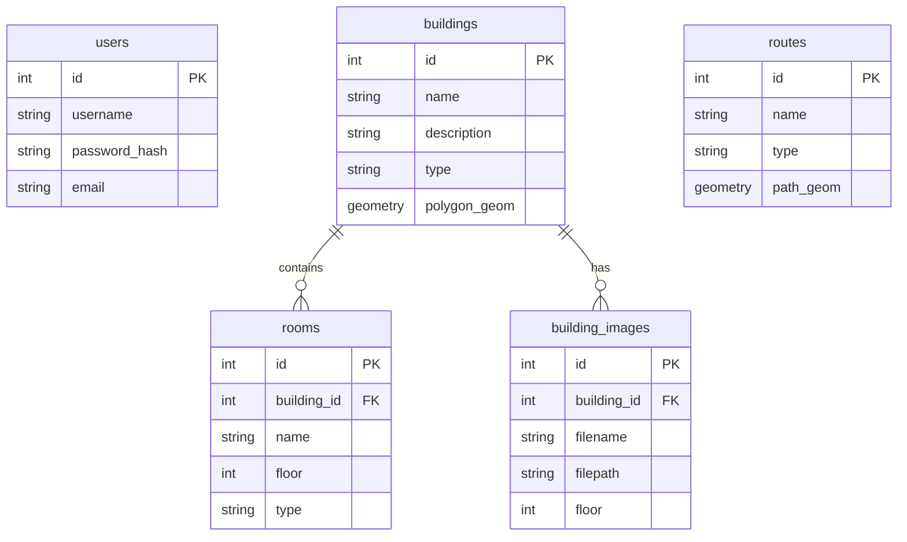

# 🗄️ Esquema de Base de Datos - InteractiveMapUCN

Este documento describe la estructura de la base de datos PostgreSQL, incluyendo las tablas, relaciones y uso de extensiones espaciales (PostGIS).

**Motor**: PostgreSQL 15+
**Extensión Espacial**: PostGIS 3.0+

## 📊 Diagrama ER Simplificado

## 📝 Definición de Tablas

### `users` (Administradores)
Almacena las credenciales de los administradores del sistema.

| Columna | Tipo | Descripción |
|---------|------|-------------|
| `id` | SERIAL (PK) | Identificador único |
| `username` | VARCHAR(50) | Nombre de usuario único |
| `password` | VARCHAR(255) | Hash bcrypt de la contraseña |
| `role` | VARCHAR(20) | Rol (admin, superadmin) |

### `buildings` (Edificios)
Representa las estructuras físicas del campus.

| Columna | Tipo | Descripción |
|---------|------|-------------|
| `id` | SERIAL (PK) | Identificador único |
| `name` | VARCHAR(100) | Nombre del edificio (e.g., "Pabellón J") |
| `type` | VARCHAR(50) | Categoría (Académico, Administrativo, etc.) |
| `location` | GEOMETRY(Polygon, 4326) | Polígono geoespacial del contorno |
| `description`| TEXT | Información adicional |

### `rooms` (Salas)
Espacios interiores gestionables dentro de los edificios.

| Columna | Tipo | Descripción |
|---------|------|-------------|
| `id` | SERIAL (PK) | Identificador único |
| `building_id`| INTEGER (FK) | Referencia a `buildings.id` |
| `name` | VARCHAR(50) | Código o nombre de la sala |
| `floor` | INTEGER | Número de piso (1, 2, -1) |
| `type` | VARCHAR(50) | Tipo (Clase, Baño, Lab) |

### `routes` (Rutas)
Segmentos de caminos para la navegación.

| Columna | Tipo | Descripción |
|---------|------|-------------|
| `id` | SERIAL (PK) | Identificador único |
| `name` | VARCHAR(100) | Nombre descriptivo (opcional) |
| `type` | VARCHAR(50) | Tipo (Peatonal, Accesible, Vehicular) |
| `geom` | GEOMETRY(LineString, 4326)| Geometría de la línea |
| `is_active` | BOOLEAN | Si la ruta está habilitada |

### `building_images` (Planos)
Imágenes de planos de planta asociadas a edificios.

| Columna | Tipo | Descripción |
|---------|------|-------------|
| `id` | SERIAL (PK) | Identificador único |
| `building_id`| INTEGER (FK) | Referencia a `buildings.id` |
| `floor` | INTEGER | Piso correspondiente al plano |
| `filepath` | VARCHAR(255) | Ruta relativa al archivo en disco |
| `uploaded_at`| TIMESTAMP | Fecha de subida |

## 🌍 Funciones PostGIS Utilizadas

El sistema hace uso intensivo de funciones espaciales para el análisis:

- **ST_Distance**: Calcula distancia en metros entre geometrías (usando casting a geography).
- **ST_Intersects**: Determina si dos geometrías se cruzan (útil para validación de rutas).
- **ST_Contains**: Verifica si un punto está dentro de un edificio.
- **ST_DWithin**: Búsquedas eficientes de "vecinos cercanos" dentro de un radio.
- **ST_Centroid**: Calcula el centro geométrico de un edificio (para marcadores).
