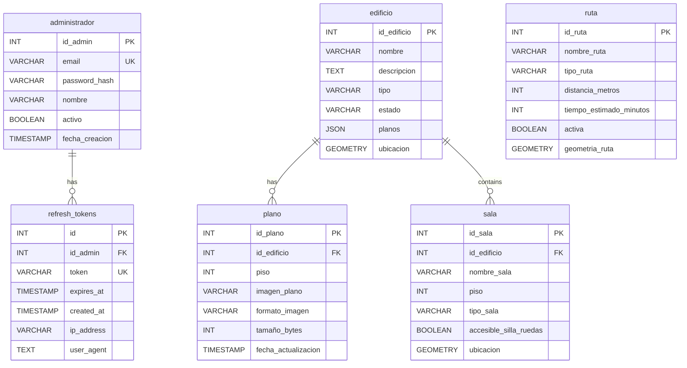

# 🗄️ Esquema de Base de Datos - InteractiveMapUCN

Este documento describe la estructura de la base de datos PostgreSQL, incluyendo las tablas, relaciones y uso de extensiones espaciales (PostGIS). El esquema sigue una convención de nomenclatura en español para coincidir con el modelo de datos implementado.

**Motor**: PostgreSQL 15+
**Extensión Espacial**: PostGIS 3.0+

## Diagrama de Entidad-Relación (MER)

## Definición de Tablas

### `administrador`
Almacena las credenciales y perfiles de los administradores del sistema.

| Columna | Tipo | Descripción |
|---------|------|-------------|
| `id_admin` | SERIAL (PK) | Identificador único |
| `email` | VARCHAR(255) | Correo electrónico (único) |
| `password_hash` | VARCHAR(255) | Hash de la contraseña (bcrypt) |
| `nombre` | VARCHAR(100) | Nombre completo del administrador |
| `activo` | BOOLEAN | Estado de la cuenta |
| `fecha_creacion` | TIMESTAMP | Fecha de registro |

### `edificio`
Representa las estructuras físicas principales del campus.

| Columna | Tipo | Descripción |
|---------|------|-------------|
| `id_edificio` | SERIAL (PK) | Identificador único |
| `nombre` | VARCHAR(100) | Nombre descriptivo del edificio |
| `descripcion` | TEXT | Información detallada |
| `tipo` | VARCHAR(50) | Categoría (e.g., Académico, Administrativo) |
| `estado` | VARCHAR(20) | Estado actual (e.g., activo) |
| `planos` | JSON | Metadatos de planos (legacy o redundante) |
| `ubicacion` | GEOMETRY(Polygon, 4326) | Geometría espacial del contorno |

### `sala`
Espacios interiores o puntos de interés dentro de los edificios.

| Columna | Tipo | Descripción |
|---------|------|-------------|
| `id_sala` | SERIAL (PK) | Identificador único |
| `id_edificio` | INTEGER (FK) | Relación con la tabla `edificio` |
| `nombre_sala` | VARCHAR(100) | Nombre o código de la sala |
| `piso` | INTEGER | Nivel en el que se encuentra |
| `tipo_sala` | VARCHAR(50) | Uso (e.g., Laboratorio, Baño, Oficina) |
| `accesible_silla_ruedas` | BOOLEAN | Flag de accesibilidad |
| `ubicacion` | GEOMETRY(Point, 4326) | Punto geográfico de la sala |

### `plano`
Archivos de imagen asociados a los niveles de cada edificio.

| Columna | Tipo | Descripción |
|---------|------|-------------|
| `id_plano` | SERIAL (PK) | Identificador único |
| `id_edificio` | INTEGER (FK) | Edificio al que pertenece |
| `piso` | INTEGER | Número de piso correspondiente |
| `imagen_plano` | VARCHAR(255) | Nombre del archivo físico |
| `formato_imagen` | VARCHAR(10) | Formato (e.g., png, jpg) |
| `tamaño_bytes` | INTEGER | Tamaño del archivo |
| `fecha_actualizacion` | TIMESTAMP | Última modificación |

### `refresh_tokens`
Gestión de sesiones persistentes para administradores.

| Columna | Tipo | Descripción |
|---------|------|-------------|
| `id` | SERIAL (PK) | Identificador único |
| `id_admin` | INTEGER (FK) | Administrador asociado |
| `token` | VARCHAR(255) | Token de refresco único |
| `expires_at` | TIMESTAMP | Fecha de expiración |
| `created_at` | TIMESTAMP | Fecha de emisión |
| `ip_address` | VARCHAR(45) | IP desde la que se generó |

### `ruta`
Segmentos de navegación entre puntos del campus.

| Columna | Tipo | Descripción |
|---------|------|-------------|
| `id_ruta` | SERIAL (PK) | Identificador único |
| `nombre_ruta` | VARCHAR(100) | Nombre descriptivo |
| `tipo_ruta` | VARCHAR(50) | Categoría (e.g., peatonal, accesible) |
| `distancia_metros` | INTEGER | Longitud calculada |
| `tiempo_estimado_minutos` | INTEGER | Tiempo promedio de recorrido |
| `activa` | BOOLEAN | Si la ruta está disponible |
| `geometria_ruta` | GEOMETRY(LineString, 4326) | Trazo geoespacial |

## Funciones PostGIS Utilizadas

El sistema hace uso intensivo de funciones espaciales para el análisis:

- **ST_Distance**: Calcula distancia en metros entre geometrías.
- **ST_Intersects**: Determina si dos geometrías se cruzan.
- **ST_Contains**: Verifica si un punto está dentro de un edificio.
- **ST_DWithin**: Búsquedas eficientes dentro de un radio determinado.
- **ST_AsGeoJSON**: Convierte geometrías PostGIS a formato GeoJSON para el frontend.
- **ST_SetSRID**: Asegura que las geometrías usen el sistema de referencia WGS84 (4326).
