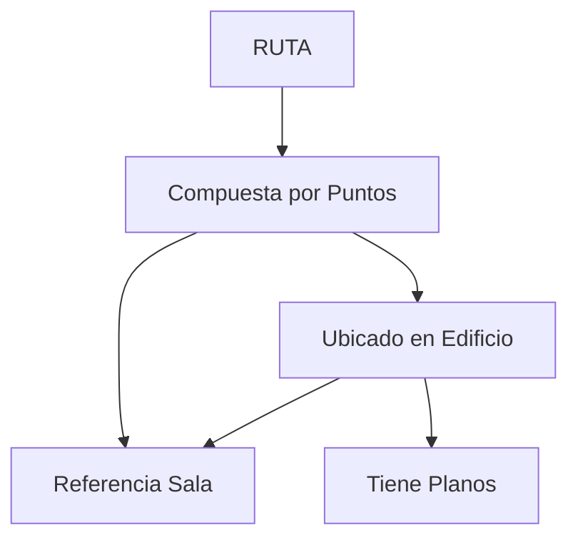

# 📊 Diccionario de Datos - Mapa Interactivo UCN (ACTUALIZADO)

## 🗃️ TABLA: ADMINISTRADOR

| Campo | Tipo | Longitud | Nulo | Por Defecto | Descripción |
|-------|------|-----------|------|-------------|-------------|
| id_admin | BIGINT | - | NO | SERIAL | Identificador único del administrador (PK) |
| email | VARCHAR | 255 | NO | - | Correo electrónico único para login |
| password_hash | VARCHAR | 255 | NO | - | Contraseña encriptada |
| nombre | VARCHAR | 100 | NO | - | Nombre completo del administrador |
| activo | BOOLEAN | - | SI | TRUE | Estado del administrador en el sistema |
| fecha_creacion | TIMESTAMP | - | SI | CURRENT_TIMESTAMP | Fecha de registro del administrador |

## 🏢 TABLA: EDIFICIO

| Campo | Tipo | Longitud | Nulo | Por Defecto | Descripción |
|-------|------|-----------|------|-------------|-------------|
| id_edificio | BIGINT | - | NO | SERIAL | Identificador único del edificio (PK) |
| nombre | VARCHAR | 100 | NO | - | Nombre del edificio (ej: "Castillo de Claudio") |
| descripcion | TEXT | - | SI | - | Descripción detallada del edificio |
| tipo | VARCHAR | 50 | NO | 'Oficina Profesor' | **Tipo de edificio** |
| lat | DECIMAL | 10,8 | SI | - | Latitud en formato decimal |
| lng | DECIMAL | 11,8 | SI | - | Longitud en formato decimal |
| ubicacion | GEOMETRY | Point,4326 | SI | - | Coordenadas geográficas del edificio (PostGIS) |
| fecha_creacion | TIMESTAMP | - | SI | CURRENT_TIMESTAMP | Fecha de registro en el sistema |

### 🎯 Valores Permitidos para CAMPO `tipo`:
```sql
'Oficina Profesor', 'Oficina Administracion', 'Sala de Clase', 
'Laboratorio', 'Biblioteca', 'Sala de Estudio', 'Baño', 'Casino',
'Cafeteria', 'Gimnasio', 'Estacionamiento', 'Auditorio', 'Taller'
```

## 🚪 TABLA: SALA

| Campo | Tipo | Longitud | Nulo | Por Defecto | Descripción |
|-------|------|-----------|------|-------------|-------------|
| id_sala | BIGINT | - | NO | SERIAL | Identificador único de la sala (PK) |
| id_edificio | BIGINT | - | NO | - | **FK** Referencia al edificio que contiene la sala |
| nombre_sala | VARCHAR | 100 | NO | - | Nombre o número de la sala (ej: "Aula 101") |
| piso | INTEGER | - | NO | 1 | Número de piso donde se encuentra la sala |
| tipo_sala | VARCHAR | 50 | NO | 'Sala Normal' | **Tipo de sala** |
| accesible_silla_ruedas | BOOLEAN | - | SI | FALSE | Indicador de accesibilidad |
| ubicacion | GEOMETRY | Point,4326 | SI | - | Coordenadas geográficas de la sala (mismas que el edificio) |
| fecha_creacion | TIMESTAMP | - | SI | CURRENT_TIMESTAMP | Fecha de registro en el sistema |

### 🎯 Valores Permitidos para CAMPO `tipo_sala`:
```sql
'Sala Normal', 'Laboratorio', 'Sala Conferencia', 'Oficina Administrativa',
'Oficina Profesor', 'Sala Estudio', 'Sala Reuniones', 'Taller', 'Auditorio',
'Cocina', 'Almacen', 'Baño', 'Otro'
```

## 🛣️ TABLA: RUTA

| Campo | Tipo | Longitud | Nulo | Por Defecto | Descripción |
|-------|------|-----------|------|-------------|-------------|
| id_ruta | BIGINT | - | NO | SERIAL | Identificador único de la ruta (PK) |
| nombre_ruta | VARCHAR | 100 | NO | - | Nombre descriptivo de la ruta |
| tipo_ruta | VARCHAR | 20 | SI | - | Tipo: peatonal, vehicular, accesible, etc. |
| distancia_metros | INTEGER | - | SI | - | Longitud total de la ruta en metros |
| tiempo_estimado_minutos | INTEGER | - | SI | - | Tiempo estimado de recorrido |
| activa | BOOLEAN | - | SI | TRUE | Estado de la ruta |
| geometria_ruta | GEOMETRY | LineString,4326 | SI | - | Geometría de la línea de ruta |
| fecha_creacion | TIMESTAMP | - | SI | CURRENT_TIMESTAMP | Fecha de creación de la ruta |

## 📍 TABLA: PUNTO_RUTA

| Campo | Tipo | Longitud | Nulo | Por Defecto | Descripción |
|-------|------|-----------|------|-------------|-------------|
| id_punto | BIGINT | - | NO | SERIAL | Identificador único del punto (PK) |
| id_ruta | BIGINT | - | NO | - | **FK** Referencia a la ruta que contiene el punto |
| id_edificio | BIGINT | - | SI | - | **FK** Referencia al edificio donde se ubica el punto |
| id_sala | BIGINT | - | SI | - | **FK** Referencia a la sala específica |
| orden | INTEGER | - | NO | - | Orden secuencial del punto en la ruta (1, 2, 3...) |
| tipo_punto | VARCHAR | 20 | SI | - | Tipo: inicio, fin, intermedio, referencia |
| coordenadas | GEOMETRY | Point,4326 | SI | - | Coordenadas geográficas del punto |
| descripcion | VARCHAR | 255 | SI | - | Descripción o instrucciones del punto |
| fecha_creacion | TIMESTAMP | - | SI | CURRENT_TIMESTAMP | Fecha de creación del punto |

## 🗺️ TABLA: PLANO

| Campo | Tipo | Longitud | Nulo | Por Defecto | Descripción |
|-------|------|-----------|------|-------------|-------------|
| id_plano | BIGINT | - | NO | SERIAL | Identificador único del plano (PK) |
| id_edificio | BIGINT | - | NO | - | **FK** Referencia al edificio del plano |
| piso | INTEGER | - | NO | - | Número de piso que representa el plano |
| imagen_plano | VARCHAR | 255 | NO | - | Ruta o URL de la imagen del plano |
| formato_imagen | VARCHAR | 10 | SI | - | Formato: PNG, JPG, SVG, etc. |
| tamaño_bytes | INTEGER | - | SI | - | Tamaño del archivo en bytes |
| fecha_actualizacion | TIMESTAMP | - | SI | CURRENT_TIMESTAMP | Fecha de última actualización |
| bbox | GEOMETRY | Polygon,4326 | SI | - | Bounding box del plano en coordenadas geográficas |

## 🔗 RELACIONES ENTRE TABLAS

### **Claves Primarias (PK):**
- `ADMINISTRADOR.id_admin`
- `EDIFICIO.id_edificio` 
- `SALA.id_sala`
- `RUTA.id_ruta`
- `PUNTO_RUTA.id_punto`
- `PLANO.id_plano`

### **Claves Foráneas (FK):**
- `SALA.id_edificio` → `EDIFICIO.id_edificio`
- `PLANO.id_edificio` → `EDIFICIO.id_edificio`
- `PUNTO_RUTA.id_ruta` → `RUTA.id_ruta`
- `PUNTO_RUTA.id_edificio` → `EDIFICIO.id_edificio`
- `PUNTO_RUTA.id_sala` → `SALA.id_sala`

## 🔄 RELACIONES IMPLEMENTADAS



## 📝 NOTAS TÉCNICAS ACTUALIZADAS

### **Sistema de Coordenadas:**
- Todas las geometrías usan **SRID 4326** (WGS84)
- Formato estándar para sistemas GIS y Leaflet

### **Cambios Implementados:**
1. **EDIFICIO**: Agregados `lat` y `lng` como DECIMAL para acceso directo
2. **SALA**: 
   - Cambiado `coordenadas_geo` → `ubicacion` (consistencia)
   - Cambiado `tipo_sala` de VARCHAR(20) → VARCHAR(50)
   - Eliminado `poligono_sala` (no usado)
   - Agregado `fecha_creacion`
3. **PUNTO_RUTA**:
   - Cambiado `coordenadas_geo` → `coordenadas`
   - Agregado `fecha_creacion`

### **Tipos de Geometría:**
- **Point**: Coordenadas puntuales (edificios, salas, puntos de ruta)
- **Polygon**: Áreas delimitadas (planos, bounding boxes)
- **LineString**: Rutas y caminos

### **Convenciones de Nombres:**
- **PK**: `id_[nombre_tabla]`
- **FK**: `id_[tabla_referenciada]`
- **Booleanos**: Prefijo `activo_`, `accesible_`, etc.
- **Fechas**: Sufijo `_creacion`, `_actualizacion`
- **Geometrías**: `ubicacion`, `coordenadas`, `geometria_`

### **Valores por Defecto Implementados:**
- `EDIFICIO.tipo`: 'Oficina Profesor'
- `SALA.piso`: 1
- `SALA.tipo_sala`: 'Sala Normal'
- `SALA.accesible_silla_ruedas`: FALSE
- Estados booleanos: TRUE para activo, FALSE para inactivo

### **Restricciones de Integridad:**
- Claves únicas en campos de email
- Relaciones con eliminación en cascada donde aplica
- Valores por defecto para estados booleanos
- Timestamps automáticos para auditoría
- Constraints de tipo para valores válidos

## 🎯 ESTRUCTURA ACTUAL EN USO

**Flujo de datos principal:**
```
EDIFICIO (con coordenadas) 
    ↓
SALA (hereda coordenadas del edificio)
    ↓  
RUTA (conecta puntos entre edificios/salas)
    ↓
PUNTO_RUTA (puntos específicos en la ruta)
```
