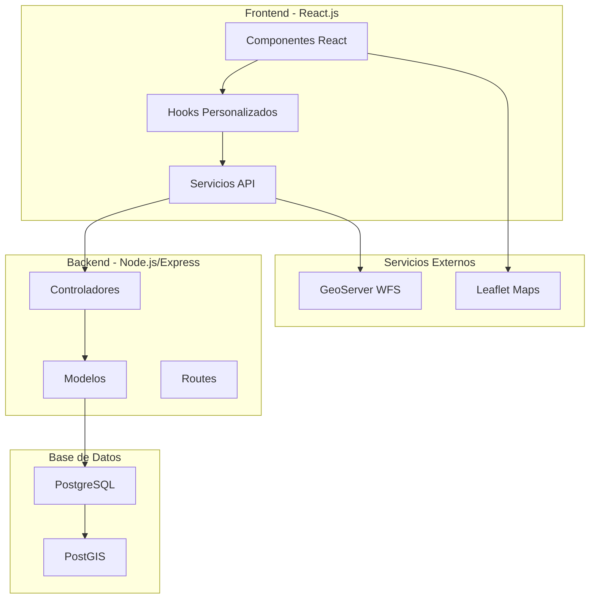
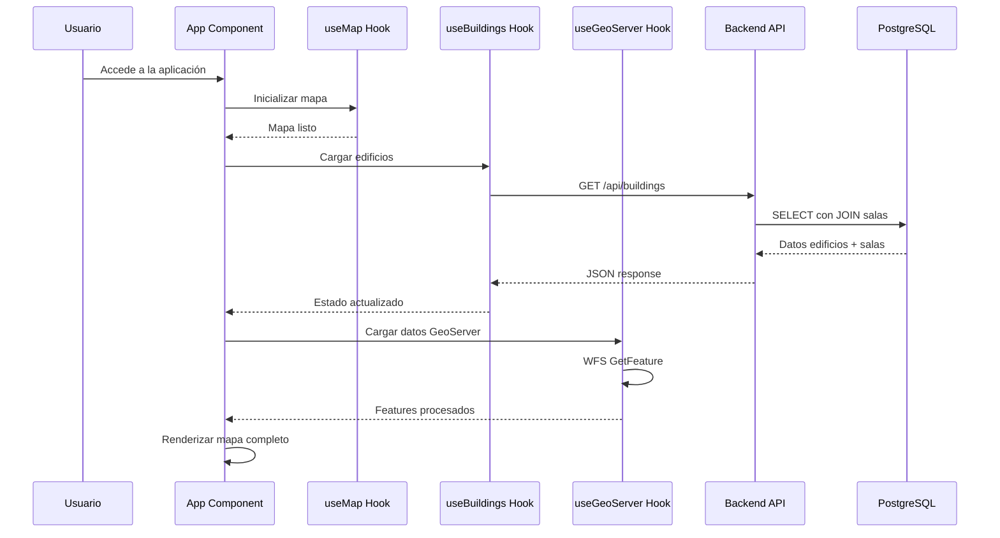
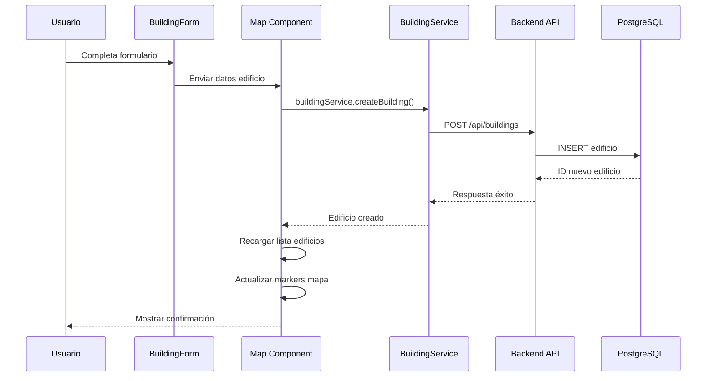

# Documentación Técnica Completa - Mapa Interactivo UCN

## **ARQUITECTURA DEL SISTEMA**

### **1. VISIÓN GENERAL**

El **Mapa Interactivo UCN** es una aplicación web full-stack diseñada para gestionar y visualizar información geoespacial del campus universitario. La arquitectura sigue el patrón **MVC (Modelo-Vista-Controlador)** con separación clara entre frontend, backend y base de datos.



### **2. TECNOLOGÍAS IMPLEMENTADAS**

#### **Frontend**
- **React 18** - Biblioteca de interfaz de usuario
- **Leaflet** - Mapas interactivos
- **CSS3** - Estilos y diseño responsive
- **JavaScript ES6+** - Lógica de aplicación

#### **Backend**
- **Node.js** - Runtime de JavaScript
- **Express.js** - Framework web
- **PostgreSQL** - Base de datos relacional
- **PostGIS** - Extensión geoespacial
- **pg** - Cliente PostgreSQL para Node.js

#### **Servicios Externos**
- **GeoServer** - Servicio WFS para datos geoespaciales
- **OpenStreetMap** - Tiles de mapas base

### **3. ESTRUCTURA DE DIRECTORIOS**

```
interactive-map-ucn/
├── frontend/                 # Aplicación React
│   ├── src/
│   │   ├── components/      # Componentes React
│   │   │   ├── Map/        # Componente principal del mapa
│   │   │   ├── Forms/      # Formularios
│   │   │   └── UI/         # Componentes de interfaz
│   │   ├── hooks/          # Custom hooks
│   │   ├── services/       # Clientes API
│   │   ├── constants/      # Configuración
│   │   └── utils/          # Utilidades
│   └── public/             # Archivos estáticos
└── backend/                # API Express
    ├── controllers/        # Lógica de negocio
    ├── models/            # Acceso a datos
    ├── routes/            # Endpoints API
    ├── config/            # Configuración
    └── middleware/        # Middlewares
```

### **4. COMPONENTES PRINCIPALES DEL FRONTEND**

#### **Map Component (`Map.js`)**
**Responsabilidad**: Componente central que coordina toda la funcionalidad del mapa.

```javascript
// Funcionalidades principales
- Inicialización y gestión del mapa Leaflet
- Coordinación de hooks personalizados
- Renderizado de edificios y elementos geoespaciales
- Manejo de interacciones del usuario
- Gestión de estados de UI (formularios, listas, modales)
```

#### **Custom Hooks**

**`useMap.js`** - Gestión del estado del mapa
```javascript
const useMap = () => {
  const [mapInstance, setMapInstance] = useState(null);
  const [isMapReady, setIsMapReady] = useState(false);
  
  // Inicialización del mapa Leaflet
  const initializeMap = (bounds) => {
    const map = L.map(mapRef.current, {
      center: calcularCentro(bounds),
      zoom: MAP_ZOOM_LIMITS.default,
      minZoom: MAP_ZOOM_LIMITS.min,
      maxZoom: MAP_ZOOM_LIMITS.max
    });
    
    // Configurar límites y controles
    map.setMaxBounds(bounds);
    L.tileLayer('https://{s}.tile.openstreetmap.org/{z}/{x}/{y}.png').addTo(map);
    
    setMapInstance(map);
    setIsMapReady(true);
  };
  
  return { mapRef, initializeMap, mapInstance, isMapReady };
};
```

**`useBuildings.js`** - Gestión de estado de edificios
```javascript
const useBuildings = () => {
  const [buildings, setBuildings] = useState([]);
  const [loading, setLoading] = useState(true);
  const [error, setError] = useState(null);
  const [backendStatus, setBackendStatus] = useState('checking');
  
  // Carga inicial de edificios
  const loadBuildings = useCallback(async () => {
    setLoading(true);
    try {
      const response = await buildingService.getAllBuildings();
      setBuildings(response.data);
      setBackendStatus('connected');
    } catch (err) {
      setError(err.message);
      setBackendStatus('error');
    } finally {
      setLoading(false);
    }
  }, []);
  
  return { buildings, loading, error, backendStatus, loadBuildings };
};
```

**`useGeoServer.js`** - Integración con GeoServer
```javascript
const useGeoServer = () => {
  const [features, setFeatures] = useState([]);
  const [status, setStatus] = useState('checking');
  
  const loadWFSData = async (map, layerName) => {
    setStatus('loading');
    try {
      const wfsUrl = `http://localhost:8080/geoserver/ows?service=WFS&typeName=${layerName}`;
      const response = await fetch(wfsUrl);
      const data = await response.json();
      
      setFeatures(data.features);
      setStatus('success');
      processGeoJSONData(map, data.features);
    } catch (error) {
      setStatus('error');
    }
  };
  
  return { status, features, loadWFSData };
};
```

#### **Servicios API**

**`buildingService.js`** - Cliente para API de edificios
```javascript
export const buildingService = {
  async getAllBuildings() {
    const response = await api.get('/buildings');
    return {
      ...response,
      data: response.data.map(building => ({
        ...building,
        salas: building.salas || [] // ✅ Garantizar array de salas
      }))
    };
  },
  
  async createBuilding(buildingData) {
    return await api.post('/buildings', buildingData);
  },
  
  async updateBuilding(id, buildingData) {
    return await api.put(`/buildings/${id}`, buildingData);
  },
  
  async deleteBuilding(id) {
    return await api.delete(`/buildings/${id}`);
  }
};
```

**`roomService.js`** - Cliente para API de salas
```javascript
export const roomService = {
  async createRooms(roomsData) {
    return await api.post('/rooms', roomsData);
  },
  
  async updateRoom(roomId, roomData) {
    return await api.put(`/rooms/${roomId}`, roomData);
  },
  
  async deleteRoom(roomId) {
    return await api.delete(`/rooms/${roomId}`);
  }
};
```

### **5. ARQUITECTURA DEL BACKEND**

#### **Modelos de Datos**

**`buildingModel.js`** - Acceso a datos de edificios
```javascript
const buildingModel = {
  async getAll() {
    const query = `
      SELECT 
        e.id_edificio as id,
        e.nombre,
        e.descripcion,
        e.tipo,
        ST_AsGeoJSON(e.ubicacion) as ubicacion_geojson,
        COALESCE(
          json_agg(salas) FILTER (WHERE salas.id_sala IS NOT NULL),
          '[]'
        ) as salas
      FROM edificio e
      LEFT JOIN sala s ON e.id_edificio = s.id_edificio
      GROUP BY e.id_edificio
    `;
    
    const result = await pool.query(query);
    return result.rows.map(row => ({
      id: row.id,
      nombre: row.nombre,
      descripcion: row.descripcion,
      tipo: row.tipo,
      ubicacion: JSON.parse(row.ubicacion_geojson),
      salas: row.salas
    }));
  }
};
```

**`roomModel.js`** - Acceso a datos de salas
```javascript
const roomModel = {
  async createRooms(roomsData) {
    const client = await pool.connect();
    try {
      await client.query('BEGIN');
      
      const createdRooms = [];
      for (const roomData of roomsData) {
        const query = `
          INSERT INTO sala (
            id_sala, id_edificio, nombre_sala, piso, 
            tipo_sala, accesible_silla_ruedas, ubicacion
          ) VALUES ($1, $2, $3, $4, $5, $6, ST_SetSRID(ST_MakePoint($7, $8), 4326))
          RETURNING *
        `;
        
        const result = await client.query(query, [
          roomData.id_sala, roomData.id_edificio, roomData.nombre_sala,
          roomData.piso, roomData.tipo_sala, roomData.accesible_silla_ruedas,
          roomData.longitud, roomData.latitud
        ]);
        
        createdRooms.push(result.rows[0]);
      }
      
      await client.query('COMMIT');
      return createdRooms;
    } catch (error) {
      await client.query('ROLLBACK');
      throw error;
    } finally {
      client.release();
    }
  }
};
```

#### **Controladores**

**`buildingsController.js`** - Lógica de negocio para edificios
```javascript
const buildingsController = {
  async getAllBuildings(req, res) {
    try {
      const buildings = await buildingModel.getAll();
      res.json({
        success: true,
        data: buildings,
        count: buildings.length
      });
    } catch (error) {
      res.status(500).json({
        success: false,
        message: 'Error obteniendo edificios: ' + error.message
      });
    }
  },
  
  async createBuilding(req, res) {
    try {
      const { nombre, descripcion, tipo, lat, lng } = req.body;
      
      // Validaciones
      if (!nombre || !lat || !lng) {
        return res.status(400).json({
          success: false,
          message: 'Nombre, latitud y longitud son requeridos'
        });
      }
      
      const buildingData = {
        nombre,
        descripcion: descripcion || '',
        tipo: tipo || 'Oficina Profesor',
        ubicacion: {
          type: 'Point',
          coordinates: [parseFloat(lng), parseFloat(lat)]
        }
      };
      
      const newBuilding = await buildingModel.create(buildingData);
      res.status(201).json({
        success: true,
        message: 'Edificio creado exitosamente',
        data: newBuilding
      });
    } catch (error) {
      res.status(500).json({
        success: false,
        message: 'Error creando edificio: ' + error.message
      });
    }
  }
};
```

### **6. BASE DE DATOS Y ESQUEMA**

#### **Esquema Principal**

```sql
-- Tabla de edificios
CREATE TABLE edificio (
    id_edificio SERIAL PRIMARY KEY,
    nombre VARCHAR(100) NOT NULL,
    descripcion TEXT,
    tipo VARCHAR(50) NOT NULL,
    ubicacion GEOMETRY(Point, 4326),
    fecha_creacion TIMESTAMP DEFAULT CURRENT_TIMESTAMP
);

-- Tabla de salas
CREATE TABLE sala (
    id_sala SERIAL PRIMARY KEY,
    id_edificio INTEGER REFERENCES edificio(id_edificio),
    nombre_sala VARCHAR(100) NOT NULL,
    piso INTEGER NOT NULL,
    tipo_sala VARCHAR(50) NOT NULL,
    accesible_silla_ruedas BOOLEAN DEFAULT FALSE,
    ubicacion GEOMETRY(Point, 4326),
    fecha_creacion TIMESTAMP DEFAULT CURRENT_TIMESTAMP
);
```

#### **Índices Espaciales**
```sql
CREATE INDEX idx_edificio_ubicacion ON edificio USING GIST(ubicacion);
CREATE INDEX idx_sala_ubicacion ON sala USING GIST(ubicacion);
CREATE INDEX idx_sala_edificio ON sala(id_edificio);
```

### **7. FLUJOS DE DATOS PRINCIPALES**

#### **Carga Inicial de la Aplicación**



#### **Creación de un Nuevo Edificio**



### **8. CONFIGURACIÓN Y CONSTANTES**

#### **Configuración del Mapa (`mapConfig.js`)**
```javascript
export const UCN_COQUIMBO_BOUNDS = [
  [-29.96800, -71.35650], // Suroeste
  [-29.96200, -71.34850]  // Noreste
];

export const MAP_ZOOM_LIMITS = {
  min: 17,
  max: 19,
  default: 18
};

export const GEO_SERVER_CONFIG = {
  baseUrl: 'http://localhost:8080/geoserver',
  workspace: 'InteractiveMap',
  layerName: 'edificio'
};
```

#### **Tipos de Edificios**
```javascript
export const BUILDING_TYPES = [
  { value: 'Oficina Profesor', label: '👨‍🏫 Oficina Profesor' },
  { value: 'Oficina Administracion', label: '📊 Oficina Admin' },
  { value: 'Sala de Clase', label: '📚 Sala de Clase' },
  { value: 'Laboratorio', label: '🔬 Laboratorio' },
  { value: 'Biblioteca', label: '📖 Biblioteca' },
  { value: 'Sala de Estudio', label: '💻 Sala Estudio' },
  { value: 'Baño', label: '🚻 Baño' },
  { value: 'Casino', label: '🍽️ Casino' },
  { value: 'Cafeteria', label: '☕ Cafetería' },
  { value: 'Gimnasio', label: '💪 Gimnasio' },
  { value: 'Estacionamiento', label: '🅿️ Estacionamiento' }
];
```

### **9. MANEJO DE ESTADOS Y ERRORES**

#### **Estados Globales de la Aplicación**
```javascript
// Estado principal en Map.js
const [globalState, setGlobalState] = useState({
  // Estados de UI
  showBuildingForm: false,
  showBuildingList: false,
  showRoomManagement: false,
  coordinateDetection: false,
  
  // Datos temporales
  editingBuilding: null,
  tempMarker: null,
  capturedCoords: null,
  selectedBuildingForRooms: null,
  
  // Estados de operación
  formSubmitting: false,
  syncInProgress: false
});
```

#### **Manejo de Errores Centralizado**
```javascript
// En errorHandler.js (backend)
const errorHandler = (err, req, res, next) => {
  console.error('Error no manejado:', err);
  
  res.status(500).json({
    success: false,
    message: 'Error interno del servidor',
    error: process.env.NODE_ENV === 'development' ? err.message : {}
  });
};

// En frontend (interceptor de API)
api.interceptors.response.use(
  response => response,
  error => {
    console.error('Error de API:', error);
    // Mostrar notificación al usuario
    showErrorNotification(error.message);
    return Promise.reject(error);
  }
);
```

### **10. SEGURIDAD Y VALIDACIONES**

#### **Validaciones de Backend**
```javascript
// Validación de coordenadas en roomsController.js
if (room.longitud === undefined || room.latitud === undefined) {
  return res.status(400).json({
    success: false,
    message: 'Las coordenadas (longitud y latitud) son requeridas'
  });
}

if (isNaN(parseFloat(room.longitud)) || isNaN(parseFloat(room.latitud))) {
  return res.status(400).json({
    success: false,
    message: 'Las coordenadas deben ser números válidos'
  });
}
```

#### **Configuración de Seguridad**
```javascript
// CORS configuration
app.use(cors({
  origin: process.env.FRONTEND_URL || 'http://localhost:3000',
  credentials: true
}));

// Security headers
app.use(helmet());
app.use(express.json({ limit: '10mb' }));
```

### **11. RENDIMIENTO Y OPTIMIZACIONES**

#### **Optimizaciones de Frontend**
```javascript
// Memoización de componentes
const BuildingList = React.memo(({ buildings, onEditBuilding }) => {
  // Componente optimizado
});

// Callbacks estables con useCallback
const handleSaveBuilding = useCallback(async (buildingData) => {
  // Lógica de guardado
}, [loadBuildings]);

// Consultas eficientes con useMemo
const buildingStats = useMemo(() => ({
  total: buildings.length,
  withRooms: buildings.filter(b => b.salas.length > 0).length
}), [buildings]);
```

#### **Optimizaciones de Base de Datos**
```sql
-- Índices para consultas frecuentes
CREATE INDEX CONCURRENTLY idx_edificio_tipo ON edificio(tipo);
CREATE INDEX CONCURRENTLY idx_sala_edificio_piso ON sala(id_edificio, piso);

-- Consultas optimizadas con EXPLAIN ANALYZE
EXPLAIN ANALYZE SELECT * FROM edificio WHERE ST_DWithin(ubicacion, ST_MakePoint(-71.34, -29.96)::geography, 1000);
```

### **12. DESPLIEGUE Y VARIABLES DE ENTORNO**

#### **Variables de Entorno**
```env
# Backend
DB_HOST=localhost
DB_PORT=5433
DB_NAME=interactive_map
DB_USER=postgres
DB_PASSWORD=password
NODE_ENV=development
PORT=3001

# Frontend
REACT_APP_API_URL=http://localhost:3001/api
REACT_APP_GEOSERVER_URL=http://localhost:8080/geoserver
```

#### **Scripts de Despliegue**
```json
{
  "scripts": {
    "dev:frontend": "cd frontend && npm start",
    "dev:backend": "cd backend && npm run dev",
    "build:frontend": "cd frontend && npm run build",
    "build:backend": "cd backend && npm run build",
    "start:production": "cd backend && npm start"
  }
}
```

Esta arquitectura proporciona una base sólida, escalable y mantenible para el Mapa Interactivo UCN, permitiendo un desarrollo eficiente y la incorporación de nuevas funcionalidades de manera organizada.