# 🗂️ InteractiveMapUCN - Estructura de Directorios y Arquitectura de Archivos

## 📁 Estructura Completa del Proyecto

```mermaid
graph TD
    A[interactive-map-ucn/] --> B[frontend/]
    A --> C[backend/]
    
    %% Frontend Structure
    B --> D[src/]
    B --> E[public/]
    
    D --> F[components/]
    D --> G[hooks/]
    D --> H[services/]
    D --> I[constants/]
    D --> J[utils/]
    D --> K[styles/]
    
    %% Components
    F --> L[Map/]
    F --> M[Forms/]
    F --> N[UI/]
    
    L --> O[Map.js]
    L --> P[Map.css]
    
    M --> Q[BuildingForm.js]
    M --> R[BuildingForm.css]
    
    N --> S[SidePanel/]
    N --> T[BuildingList/]
    N --> U[RoomManagement/]
    N --> V[Dropdown/]
    
    %% Hooks
    G --> W[useMap.js]
    G --> X[useBuildings.js]
    G --> Y[useGeoServer.js]
    G --> Z[index.js]
    
    %% Services
    H --> AA[buildingService.js]
    H --> BB[roomService.js]
    H --> CC[geoServerAPI.js]
    H --> DD[api.js]
    H --> EE[index.js]
    
    %% Constants & Utils
    I --> FF[mapConfig.js]
    J --> GG[mapUtils.js]
    K --> HH[globals.css]
    
    %% Public
    E --> II[index.html]
    
    %% Backend Structure
    C --> JJ[controllers/]
    C --> KK[models/]
    C --> LL[routes/]
    C --> MM[config/]
    C --> NN[middleware/]
    
    JJ --> OO[buildingsController.js]
    JJ --> PP[roomsController.js]
    
    KK --> QQ[buildingModel.js]
    KK --> RR[roomModel.js]
    
    LL --> SS[buildings.js]
    LL --> TT[rooms.js]
    LL --> UU[health.js]
    
    MM --> VV[database.js]
    NN --> WW[errorHandler.js]
    
    style A fill:#2e7d32
    style B fill:#1976d2
    style C fill:#d32f2f
    style D fill:#2196f3
    style F fill:#bbdefb
    style G fill:#c8e6c9
    style H fill:#ffecb3
```



---

## 🎯 Descripción Detallada de Archivos

### **🌐 Frontend - React Application**

#### **📦 Components/**
| Archivo | Tecnología | Responsabilidad |
|---------|------------|-----------------|
| **`Map/Map.js`** | React + Leaflet | Componente principal del mapa |
| **`Map/Map.css`** | CSS | Estilos del mapa |
| **`Forms/BuildingForm.js`** | React | Formulario crear/editar edificios |
| **`Forms/BuildingForm.css`** | CSS | Estilos del formulario |
| **`UI/SidePanel/`** | React | Panel de navegación lateral |
| **`UI/BuildingList/`** | React | Lista y gestión de edificios |
| **`UI/RoomManagement/`** | React | Gestión de salas por edificio |
| **`UI/Dropdown/`** | React | Componentes de menú desplegable |

#### **⚓ Hooks/**
| Archivo | Tecnología | Responsabilidad |
|---------|------------|-----------------|
| **`useMap.js`** | React Hooks | Gestión del estado del mapa Leaflet |
| **`useBuildings.js`** | React Hooks | Estado y operaciones de edificios |
| **`useGeoServer.js`** | React Hooks | Integración con GeoServer WFS |
| **`index.js`** | JavaScript | Exportación centralizada de hooks |

#### **🔌 Services/**
| Archivo | Tecnología | Responsabilidad |
|---------|------------|-----------------|
| **`buildingService.js`** | JavaScript | Cliente API para edificios |
| **`roomService.js`** | JavaScript | Cliente API para salas |
| **`geoServerAPI.js`** | JavaScript | Cliente WFS para GeoServer |
| **`api.js`** | JavaScript | Cliente HTTP base (fetch) |
| **`index.js`** | JavaScript | Exportación centralizada |

#### **⚙️ Configuración**
| Archivo | Tecnología | Responsabilidad |
|---------|------------|-----------------|
| **`constants/mapConfig.js`** | JavaScript | Configuración del mapa y límites |
| **`utils/mapUtils.js`** | JavaScript | Utilidades para el mapa |
| **`styles/globals.css`** | CSS | Estilos globales de la aplicación |

#### **📄 Archivos Raíz Frontend**
| Archivo | Tecnología | Responsabilidad |
|---------|------------|-----------------|
| **`public/index.html`** | HTML | Template principal HTML |
| **`src/App.js`** | React | Componente raíz de la aplicación |
| **`src/index.js`** | React | Punto de entrada de la aplicación |

---

### **⚙️ Backend - Node.js/Express**

#### **🎮 Controllers/**
| Archivo | Tecnología | Responsabilidad |
|---------|------------|-----------------|
| **`buildingsController.js`** | Node.js | Lógica de negocio para edificios |
| **`roomsController.js`** | Node.js | Lógica de negocio para salas |

#### **🗃️ Models/**
| Archivo | Tecnología | Responsabilidad |
|---------|------------|-----------------|
| **`buildingModel.js`** | Node.js + PostgreSQL | Acceso a datos de edificios |
| **`roomModel.js`** | Node.js + PostgreSQL | Acceso a datos de salas |

#### **🛣️ Routes/**
| Archivo | Tecnología | Responsabilidad |
|---------|------------|-----------------|
| **`buildings.js`** | Express Router | Rutas API para edificios |
| **`rooms.js`** | Express Router | Rutas API para salas |
| **`health.js`** | Express Router | Rutas de salud del sistema |

#### **🔧 Configuración Backend**
| Archivo | Tecnología | Responsabilidad |
|---------|------------|-----------------|
| **`config/database.js`** | Node.js + pg | Configuración pool de PostgreSQL |
| **`middleware/errorHandler.js`** | Express | Manejo centralizado de errores |

---

## 🔄 Flujos de Archivos por Funcionalidad

### **🏢 Gestión de Edificios**
```
Frontend: BuildingForm.js → buildingService.js → api.js
Backend: buildings.js → buildingsController.js → buildingModel.js → database.js
```

### **🗺️ Renderizado del Mapa**
```
Map.js → useMap.js → mapConfig.js → Leaflet
Map.js → useBuildings.js → buildingService.js
Map.js → useGeoServer.js → geoServerAPI.js
```

### **🚪 Gestión de Salas**
```
RoomManagement.js → roomService.js → api.js
Backend: rooms.js → roomsController.js → roomModel.js → database.js
```

### **🎛️ Navegación y UI**
```
SidePanel.js → BuildingList.js → buildingService.js
```

---

## 📊 Dependencias y Tecnologías por Capa

### **Frontend Technologies**
```json
{
  "react": "UI Components",
  "leaflet": "Interactive Maps",
  "css": "Styling",
  "javascript": "Business Logic"
}
```

### **Backend Technologies**
```json
{
  "express": "HTTP Server",
  "pg": "PostgreSQL Client",
  "postgis": "Spatial Queries",
  "cors": "Cross-Origin Requests"
}
```

### **Database Technologies**
```json
{
  "postgresql": "Relational Database",
  "postgis": "Spatial Extension",
  "geometry-types": "Point, Polygon storage"
}
```

---

## 🎯 Estructura de Import/Export

### **Frontend Import Patterns**
```javascript
// En Map.js
import { useMap } from '../../hooks/useMap';
import { useBuildings } from '../../hooks/useBuildings';
import { useGeoServer } from '../../hooks/useGeoServer';
import BuildingForm from '../Forms/BuildingForm';
import SidePanel from '../UI/SidePanel';
import { buildingService } from '../../services/buildingService';
```

### **Backend Import Patterns**
```javascript
// En buildingsController.js
const buildingModel = require('../models/buildingModel');

// En buildings.js (routes)
const buildingsController = require('../controllers/buildingsController');
```

---

## 🔧 Configuración de Desarrollo

### **Variables de Entorno**
```
# Frontend
REACT_APP_API_URL=http://localhost:3001/api
REACT_APP_GEOSERVER_URL=http://localhost:8080/geoserver

# Backend
DB_HOST=localhost
DB_PORT=5433
DB_NAME=interactive_map
DB_USER=postgres
DB_PASSWORD=password
```

### **Scripts de Ejecución**
```json
{
  "frontend": "cd frontend && npm start",
  "backend": "cd backend && npm run dev",
  "full-stack": "concurrently 'npm run backend' 'npm run frontend'"
}
```

---

## 🚀 Características de la Estructura

### **✅ Ventajas de la Organización**
- **Separación clara** entre frontend y backend
- **Modularidad** por funcionalidad
- **Reutilización** de componentes y servicios
- **Escalabilidad** para nuevas características
- **Mantenibilidad** con responsabilidades definidas

### **📈 Escalabilidad Futura**
- **Nuevos componentes**: Agregar en carpetas existentes
- **Nuevas entidades**: Seguir patrones establecidos
- **Nuevos servicios**: Extender estructura de servicios
- **Microservicios**: Separar en repositorios independientes

Esta estructura proporciona una **base sólida y organizada** para el desarrollo y mantenimiento del sistema InteractiveMapUCN, siguiendo las mejores prácticas de desarrollo full-stack.