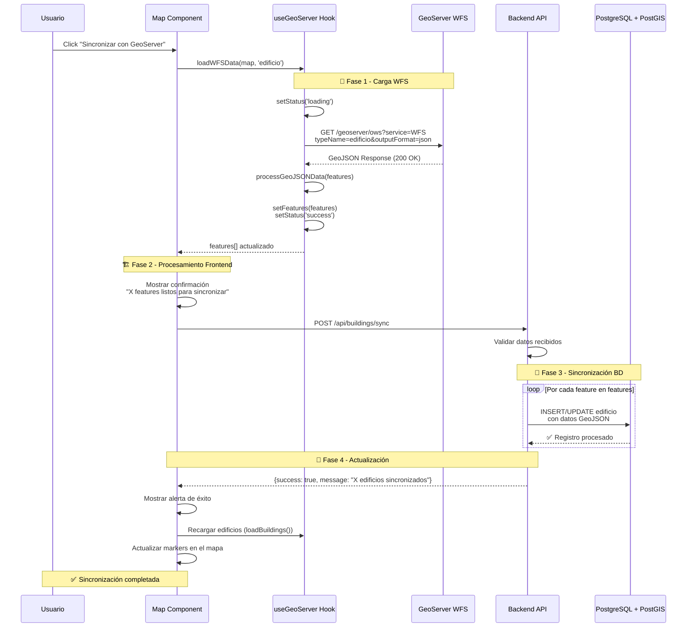

# 🔄 InteractiveMapUCN - Flujo de Sincronización GeoServer

## 📊 Diagrama de Secuencia de Sincronización



---

## 🔧 Detalles Técnicos del Flujo

### **📡 Fase 1: Carga WFS desde GeoServer**

#### **URL de Solicitud WFS**
```javascript
const wfsUrl = `http://localhost:8080/geoserver/InteractiveMap/ows?
  service=WFS&
  version=1.0.0&
  request=GetFeature&
  typeName=InteractiveMap:edificio&
  outputFormat=application/json`;
```

#### **Procesamiento GeoJSON**
```javascript
// En useGeoServer.js - processGeoJSONData()
const processGeoJSONData = (map, features) => {
  features.forEach(feature => {
    // Determinar estilo basado en geometría
    if (feature.geometry.type === 'Point') {
      L.marker(latlng, { icon: createCustomIcon(feature) });
    } else if (feature.geometry.type === 'Polygon') {
      L.polygon(coords, { color: '#ff7800', weight: 3 });
    }
    
    // Crear popup con propiedades
    const popupContent = `<h4>${feature.properties.nombre}</h4>`;
    layer.bindPopup(popupContent).addTo(map);
  });
};
```

### **💾 Fase 2-3: Sincronización Backend**

#### **Controlador de Sincronización**
```javascript
// En buildingsController.js
async syncWithGeoServer(req, res) {
  try {
    const { features } = req.body;
    
    console.log(`🔄 Sincronizando ${features.length} features...`);
    
    // Procesar cada feature
    for (const feature of features) {
      const buildingData = transformGeoJSONToBuilding(feature);
      await buildingModel.syncBuilding(buildingData);
    }
    
    res.json({
      success: true,
      message: `${features.length} edificios sincronizados exitosamente`,
      data: features
    });
  } catch (error) {
    console.error('❌ Error en sincronización:', error);
    res.status(500).json({
      success: false,
      message: 'Error en sincronización: ' + error.message
    });
  }
}
```

#### **Transformación de Datos GeoJSON**
```javascript
function transformGeoJSONToBuilding(feature) {
  const props = feature.properties;
  const geometry = feature.geometry;
  
  return {
    nombre: props.nombre || 'Edificio sin nombre',
    descripcion: props.descripcion || '',
    tipo: props.tipo || 'Oficina Profesor',
    ubicacion: {
      type: geometry.type,
      coordinates: geometry.coordinates
    }
  };
}
```

### **🔄 Fase 4: Actualización Frontend**

#### **Manejo de Respuesta Exitosa**
```javascript
// En Map.js - handleSyncData()
const handleSyncData = async () => {
  if (geoServerFeatures.length > 0) {
    try {
      // Ejecutar sincronización
      await syncWithGeoServer(geoServerFeatures);
      
      // Mostrar feedback al usuario
      alert(`${geoServerFeatures.length} edificios sincronizados`);
      
      // Recargar datos actualizados
      await loadBuildings();
      
      // Forzar re-renderizado del mapa
      setMapUpdateCount(prev => prev + 1);
      
    } catch (error) {
      alert('Error sincronizando datos: ' + error.message);
    }
  } else {
    alert('No hay datos de GeoServer para sincronizar');
  }
};
```

---

## 🛡️ Manejo de Errores y Casos Edge

### **❌ Escenarios de Error**

#### **GeoServer No Disponible**
```javascript
// En useGeoServer.js
try {
  const response = await fetch(wfsUrl);
  if (!response.ok) throw new Error(`HTTP ${response.status}`);
  // ... procesamiento exitoso
} catch (error) {
  console.error('❌ Error cargando datos GeoServer:', error);
  setStatus('error');
  setFeatures([]);
}
```

#### **Datos GeoServer Vacíos**
```javascript
if (!data.features || data.features.length === 0) {
  setStatus('empty');
  console.log('⚠️ GeoServer no devolvió features');
  return;
}
```

#### **Error en Sincronización Backend**
```javascript
// En Map.js
try {
  await syncWithGeoServer(geoServerFeatures);
} catch (error) {
  console.error('❌ Error en sincronización:', error);
  // Mostrar error específico al usuario
  alert(`Error: ${error.response?.data?.message || error.message}`);
}
```

### **✅ Casos de Éxito**

#### **Sincronización Parcial Exitosa**
```javascript
// El backend podría manejar sincronizaciones parciales
{
  success: true,
  message: "15 de 20 edificios sincronizados",
  failed: 5,
  details: [
    { featureId: 1, status: "success" },
    { featureId: 2, status: "error", reason: "Duplicate" }
  ]
}
```

#### **Actualización en Tiempo Real**
```javascript
// Recarga automática después de sincronización
await loadBuildings(); // Vuelve a cargar desde BD actualizada

// Los nuevos edificios aparecen inmediatamente en el mapa
// con el estilo de "Base de Datos" (ícono morado)
```

---

## 🔄 Estados del Sistema Durante Sincronización

### **Estados en useGeoServer Hook**
```javascript
const [status, setStatus] = useState('checking'); // 'checking' | 'loading' | 'success' | 'error' | 'empty'
const [features, setFeatures] = useState([]);
```

### **Estados en Map Component**
```javascript
const [backendStatus, setBackendStatus] = useState('checking');
const [buildingsLoading, setBuildingsLoading] = useState(false);
const [syncInProgress, setSyncInProgress] = useState(false);
```

### **Flujo de Estados Visuales**
```
Usuario click → Sincronización iniciada → Loading WFS → 
Features cargados → Sincronizando BD → Recargando datos → 
✅ Completado
```

---

## 📊 Métricas y Logging

### **Logging de Depuración**
```javascript
console.log('📡 Cargando datos de GeoServer...');
console.log(`✅ ${data.features.length} features recibidos`);
console.log('🔄 Procesando GeoJSON y agregando al mapa...');
console.log(`💾 Sincronizando ${features.length} edificios...`);
console.log('✅ Sincronización completada exitosamente');
```

### **Métricas de Performance**
```javascript
// Medición de tiempo de sincronización
const startTime = Date.now();
await syncWithGeoServer(geoServerFeatures);
const endTime = Date.now();
console.log(`⏱️ Sincronización tomó ${endTime - startTime}ms`);
```

---

## 🎯 Beneficios del Flujo de Sincronización

### **✅ Para el Usuario**
- **Feedback visual** en cada etapa del proceso
- **Confirmación** antes de operaciones críticas
- **Notificaciones** de éxito/error claras
- **Datos actualizados** inmediatamente después

### **✅ Para el Desarrollador**
- **Logging detallado** para debugging
- **Manejo robusto** de errores
- **Separación clara** de responsabilidades
- **Fácil extensión** para nuevas funcionalidades

### **✅ Para el Sistema**
- **Consistencia de datos** entre GeoServer y PostgreSQL
- **Eficiencia** en el procesamiento por lotes
- **Escalabilidad** para grandes volúmenes de datos
- **Resiliencia** ante fallos parciales

Este flujo de sincronización asegura una **integración robusta y confiable** entre los datos geoespaciales de GeoServer y la base de datos de la aplicación, manteniendo una **experiencia de usuario fluida** y **datos consistentes** en todo el sistema.