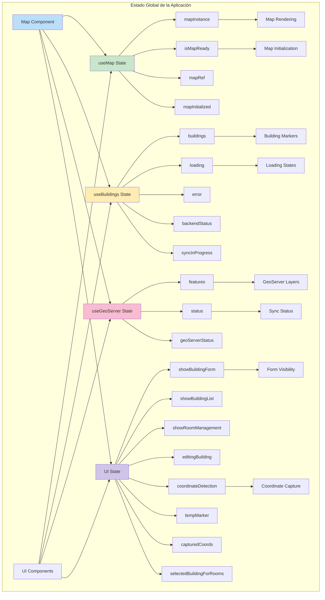

# 🧠 InteractiveMapUCN - Arquitectura de Estado Global

## 📊 Diagrama de Estado Global de la Aplicación



---

## 🎯 Detalle de los Estados Globales

### **🗺️ Estado del Mapa (useMap Hook)**
```javascript
const useMapState = {
  // Referencias y instancias
  mapRef: useRef(null),           // ✅ Referencia al contenedor del mapa
  mapInstance: null,              // ✅ Instancia de Leaflet
  mapInstanceRef: useRef(null),   // ✅ Referencia persistente
  
  // Estados de disponibilidad
  isMapReady: false,              // ✅ Mapa completamente inicializado
  mapInitialized: false,          // ✅ Proceso de inicialización completado
  
  // Efectos derivados
  tileLayers: [],                 // ✅ Capas de tiles cargadas
  mapBounds: null,                // ✅ Límites geográficos actuales
  currentZoom: 18                 // ✅ Nivel de zoom actual
};
```

### **🏢 Estado de Edificios (useBuildings Hook)**
```javascript
const useBuildingsState = {
  // Datos principales
  buildings: [],                  // ✅ Array de edificios con salas
  buildingsLoading: true,         // ✅ Estado de carga inicial
  buildingsError: null,           // ✅ Errores de carga
  
  // Estado del backend
  backendStatus: 'checking',      // ✅ 'checking' | 'connected' | 'error'
  syncInProgress: false,          // ✅ Sincronización en progreso
  
  // Datos derivados
  buildingLayers: [],             // ✅ Capas de Leaflet para edificios
  mapUpdateCount: 0,              // ✅ Contador para forzar re-render
  
  // Estadísticas
  totalBuildings: 0,              // ✅ Conteo total de edificios
  totalRooms: 0                   // ✅ Conteo total de salas
};
```

### **🌐 Estado de GeoServer (useGeoServer Hook)**
```javascript
const useGeoServerState = {
  // Datos WFS
  features: [],                   // ✅ Features GeoJSON de GeoServer
  geoServerStatus: 'checking',    // ✅ Estado de conexión GeoServer
  
  // Estados de operación
  status: 'checking',             // ✅ 'checking' | 'loading' | 'success' | 'error' | 'empty'
  wfsLayers: [],                  // ✅ Capas WFS cargadas en el mapa
  
  // Métricas
  featuresCount: 0,               // ✅ Número de features cargados
  lastSync: null                  // ✅ Timestamp última sincronización
};
```

### **🎛️ Estado de UI (Map Component)**
```javascript
const uiState = {
  // Visibilidad de componentes
  showBuildingForm: false,        // ✅ Formulario de edificios visible
  showBuildingList: false,        // ✅ Lista de edificios visible
  showRoomManagement: false,      // ✅ Gestión de salas visible
  
  // Modos de operación
  coordinateDetection: false,     // ✅ Modo captura de coordenadas activo
  roomManagementMode: 'create',   // ✅ 'create' | 'edit'
  
  // Datos temporales
  editingBuilding: null,          // ✅ Edificio siendo editado
  tempMarker: null,               // ✅ Marcador temporal de coordenadas
  capturedCoords: null,           // ✅ Coordenadas capturadas
  
  // Selecciones
  selectedBuildingForRooms: null, // ✅ Edificio seleccionado para salas
  selectedRooms: [],              // ✅ Salas seleccionadas para edición
  
  // Estados de operación
  formSubmitting: false,          // ✅ Envío de formulario en progreso
  deleteConfirm: null             // ✅ Confirmación de eliminación
};
```

---

## 🔄 Flujos de Actualización de Estado

### **1. Inicialización de la Aplicación**
```javascript
// Secuencia de inicialización
useEffect(() => {
  // 1. Inicializar mapa
  initializeMap(UCN_COQUIMBO_BOUNDS);
  setMapInitialized(true);
  
  // 2. Verificar backend
  checkBackendHealth().then(isHealthy => {
    if (isHealthy) {
      // 3. Cargar edificios
      loadBuildings();
      // 4. Cargar datos GeoServer
      loadWFSData(mapInstance, 'edificio');
    }
  });
}, []);
```

### **2. Actualización por Interacción de Usuario**
```javascript
// Ejemplo: Agregar nuevo edificio
const handleAddBuilding = () => {
  setEditingBuilding(null);           // ✅ Resetear edición
  setShowBuildingForm(true);          // ✅ Mostrar formulario
  setCapturedCoords(null);            // ✅ Limpiar coordenadas previas
  setShowBuildingList(false);         // ✅ Ocultar lista
};
```

### **3. Sincronización de Estados**
```javascript
// Cuando se cargan edificios desde el backend
useEffect(() => {
  if (buildings.length > 0) {
    // Actualizar capas del mapa
    updateBuildingLayers();
    // Incrementar contador para re-render
    setMapUpdateCount(prev => prev + 1);
  }
}, [buildings, mapInstance]);
```

---

## 🎯 Relaciones entre Estados

### **Dependencias Críticas**
```javascript
// El mapa debe estar listo antes de cargar datos geoespaciales
useEffect(() => {
  if (isMapReady && mapInstance && geoServerStatus === 'checking') {
    setTimeout(() => loadWFSData(mapInstance, 'edificio'), 500);
  }
}, [isMapReady, mapInstance, geoServerStatus, loadWFSData]);

// La detección de coordenadas requiere el mapa
useEffect(() => {
  if (!mapInstance || !coordinateDetection) return;
  
  const handleMapClick = (e) => {
    const { lat, lng } = e.latlng;
    setCapturedCoords({ lat, lng });
    // ... más lógica
  };
  
  mapInstance.on('click', handleMapClick);
  return () => mapInstance.off('click', handleMapClick);
}, [mapInstance, coordinateDetection]);
```

### **Estados Derivados**
```javascript
// Número total de salas (derivado de buildings)
const totalRooms = buildings.reduce((total, building) => 
  total + (building.salas ? building.salas.length : 0), 0
);

// Estado combinado de carga
const globalLoading = buildingsLoading || 
                     (geoServerStatus === 'loading') || 
                     !isMapReady;

// Hay datos para sincronizar
const hasDataToSync = geoServerFeatures.length > 0 && 
                     backendStatus === 'connected';
```

---

## 🛡️ Manejo de Estados de Error

### **Jerarquía de Estados de Error**
```javascript
const errorStates = {
  // Nivel 1: Error de conexión backend
  backendError: backendStatus === 'error',
  
  // Nivel 2: Error de carga de datos
  dataError: !!buildingsError,
  
  // Nivel 3: Error de GeoServer
  geoServerError: geoServerStatus === 'error',
  
  // Nivel 4: Error de mapa
  mapError: !isMapReady && mapInitialized
};
```

### **Recuperación de Errores**
```javascript
// Reintento automático para carga de edificios
const loadBuildings = useCallback(async () => {
  if (backendStatus === 'error') {
    console.log('⚠️ Backend no disponible, omitiendo carga');
    return;
  }
  
  setLoading(true);
  setError(null);
  try {
    const response = await buildingService.getAllBuildings();
    setBuildings(response.data || []);
    setBackendStatus('connected');
  } catch (err) {
    setError(err.message);
    setBackendStatus('error');
  } finally {
    setLoading(false);
  }
}, [backendStatus]);
```

---

## 📊 Visualización del Estado en UI

### **Indicadores de Estado**
```javascript
// En SidePanel.jsx - Mostrar estado del sistema
const getStatusStyle = () => {
  if (backendStatus === 'error') {
    return { backgroundColor: '#e74c3c' }; // 🔴 Error backend
  }
  
  switch (status) {
    case 'success': return { backgroundColor: '#2ecc71' }; // 🟢 Éxito
    case 'empty': return { backgroundColor: '#f39c12' };   // 🟡 Vacío
    case 'error': return { backgroundColor: '#e74c3c' };   // 🔴 Error
    default: return { backgroundColor: '#3498db' };        // 🔵 Cargando
  }
};
```

### **Estados de Loading**
```javascript
// Múltiples estados de carga simultáneos
const loadingStates = {
  mapLoading: !isMapReady,
  buildingsLoading: buildingsLoading,
  geoserverLoading: geoServerStatus === 'loading',
  
  // Estado combinado
  anyLoading: !isMapReady || buildingsLoading || geoServerStatus === 'loading'
};
```

---

## 🔮 Patrones de Gestión de Estado

### **Separación de Responsabilidades**
- **useMap**: Estado puramente del mapa Leaflet
- **useBuildings**: Estado de datos de edificios y salas
- **useGeoServer**: Estado de integración con servicios externos
- **UI State**: Estado de interfaz de usuario y interacciones

### **Inmutabilidad y Actualizaciones**
```javascript
// Actualizaciones correctas de arrays
setBuildings(prev => prev.filter(building => building.id !== id));

// Actualizaciones correctas de objetos
setFormData(prev => ({
  ...prev,
  [name]: value
}));
```

### **Performance y Optimización**
```javascript
// Evitar re-renders innecesarios
const buildingsCount = useMemo(() => buildings.length, [buildings]);
const hasBuildings = useMemo(() => buildings.length > 0, [buildings]);

// Callbacks estables
const handleSaveBuilding = useCallback(async (buildingData) => {
  // ... lógica de guardado
}, [loadBuildings]);
```

Esta arquitectura de estado proporciona una **gestión robusta y predecible** del estado global de la aplicación, permitiendo una **UI reactiva** y un **flujo de datos consistente** entre todos los componentes del sistema.