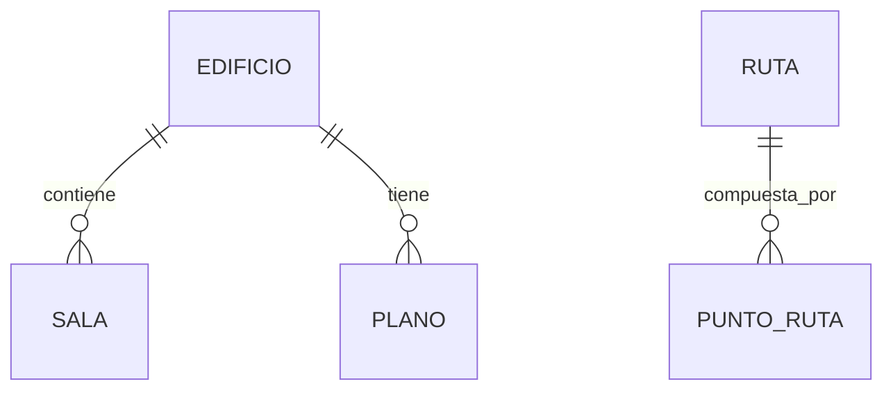

# 📋 Resumen Ejecutivo - InteractiveMapUCN

## 🎯 Descripción General
**InteractiveMapUCN** es una aplicación web full-stack para gestionar y visualizar información geoespacial del campus universitario UCN Coquimbo. Combina tecnologías modernas para ofrecer mapas interactivos con gestión completa de edificios y salas.

---

## 🏗️ Arquitectura del Sistema

### **Frontend (React.js)**
- **Componente Principal**: `Map.js` - Coordina toda la aplicación
- **Custom Hooks**: 
  - `useMap`: Gestión del mapa Leaflet (biblioteca de JavaScript de código abierto, ligera y fácil de usar para crear mapas web interactivos y compatibles con dispositivos móviles)
  - `useBuildings`: Estado de edificios y salas
  - `useGeoServer`: Integración con servicios Web Feature Service (WFS). GeoServer es un servidor de software de código abierto que permite compartir, editar y visualizar datos geoespaciales a través de la web utilizando estándares abiertos como OGC (OGC significa Open Geospatial Consortium (Consorcio Geoespacial Abierto), una organización internacional sin fines de lucro que desarrolla y publica estándares para la interoperabilidad de datos y servicios geográficos.)
- **Servicios API**: `buildingService`, `roomService` para comunicación con backend
- **UI Components**: Formularios, SidePanel, listas y gestión de salas

### **Backend (Node.js/Express)**
- **Controladores**: Lógica de negocio para edificios y salas
- **Modelos**: Acceso a datos con PostgreSQL + PostGIS
- **API REST**: Endpoints completos para operaciones CRUD
- **Base de Datos**: PostgreSQL con extensión PostGIS para datos espaciales

### **Integraciones Externas**
- **GeoServer**: Sincronización WFS para datos geoespaciales
- **Leaflet + OpenStreetMap**: Mapas interactivos y tiles base

---

## 🗃️ Esquema de Base de Datos

### **Tablas Principales**

**Tablas Implementadas:**
- `EDIFICIO`: Información de edificios con geometría Point
- `SALA`: Salas asociadas a edificios, heredan coordenadas
- `ADMINISTRADOR`: Gestión de usuarios (por implementar)
- `RUTA`/`PUNTO_RUTA`: Sistema de navegación (futuro)
- `PLANO`: Planos internos de edificios (futuro)

---

## 🚀 Funcionalidades Implementadas

### ✅ **Gestión Completa de Edificios**
- Crear, editar, eliminar edificios
- Captura interactiva de coordenadas
- Tipos predefinidos con íconos y colores
- Validación de datos

### ✅ **Gestión de Salas**
- Creación múltiple por edificio
- Asignación de pisos y características
- Integración jerárquica edificio → salas
- Operaciones CRUD completas

### ✅ **Integración GeoServer**
- Sincronización bidireccional
- Carga de datos WFS
- Procesamiento de GeoJSON
- Visualización de capas en mapa

### ✅ **Interfaz de Usuario**
- Mapa interactivo con Leaflet
- SidePanel con navegación
- Formularios modales
- Feedback visual de estados

---

## 🔄 Flujos de Datos Principales

1. **Carga Inicial**: Frontend → Backend → PostgreSQL → Renderizado mapa
2. **Gestión Edificios**: Formularios → API → BD → Actualización en tiempo real
3. **Sincronización GeoServer**: WFS → Procesamiento → BD → Visualización
4. **Gestión Salas**: RoomManagement → API → BD → Actualización estado

---

## 🛡️ Características Técnicas

### **Arquitectura Sólida**
- Separación clara de responsabilidades
- Patrón MVC bien implementado
- Hooks personalizados para gestión de estado
- Servicios modulares y reutilizables

### **Manejo de Estado Robusto**
- Estados separados por dominio (mapa, edificios, GeoServer, UI)
- Actualizaciones inmutables
- Manejo completo de errores
- Estados de loading y sincronización

### **Optimizaciones**
- Índices espaciales en PostgreSQL
- Memoización de componentes React
- Consultas eficientes con JOINs
- Manejo de conexiones con connection pool

---

## 📈 Estado del Proyecto

### **✅ Completamente Funcional**
- Backend API REST completo
- Frontend React con todas las funcionalidades principales
- Base de datos con PostGIS operativa
- Integración GeoServer funcionando

### **🚀 Listo para Producción**
- Manejo de errores robusto
- Validaciones de datos
- Logging y debugging
- Configuración mediante variables de entorno

---

## 🔮 Próximas Mejoras Planificadas

### **Alta Prioridad**
1. **Sistema de Autenticación** para administradores
2. **Navegación por Categorías** para usuarios
3. **Sistema de Rutas** entre edificios

### **Futuras Funcionalidades**
- Planos internos de edificios
- Panel de administración avanzado
- Búsqueda y filtrado mejorado
- Mobile responsive

---

## 🎯 Conclusión

El sistema **InteractiveMapUCN** demuestra una **arquitectura sólida y bien estructurada** con:
- ✅ Separación clara entre frontend, backend y base de datos
- ✅ Integración efectiva de datos geoespaciales
- ✅ Experiencia de usuario fluida e intuitiva
- ✅ Código mantenible y escalable
- ✅ Documentación técnica completa

**Estado Actual**: 🟢 **Funcional y Estable** - Listo para uso y futuras expansiones.