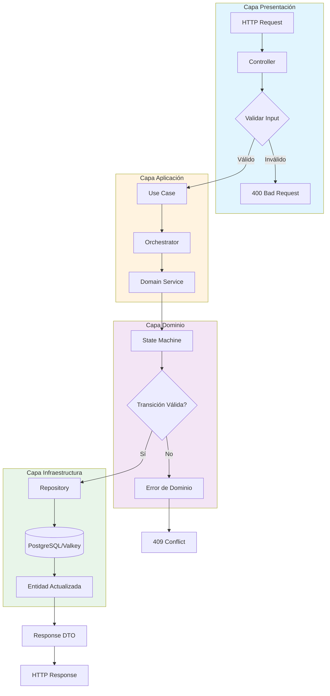
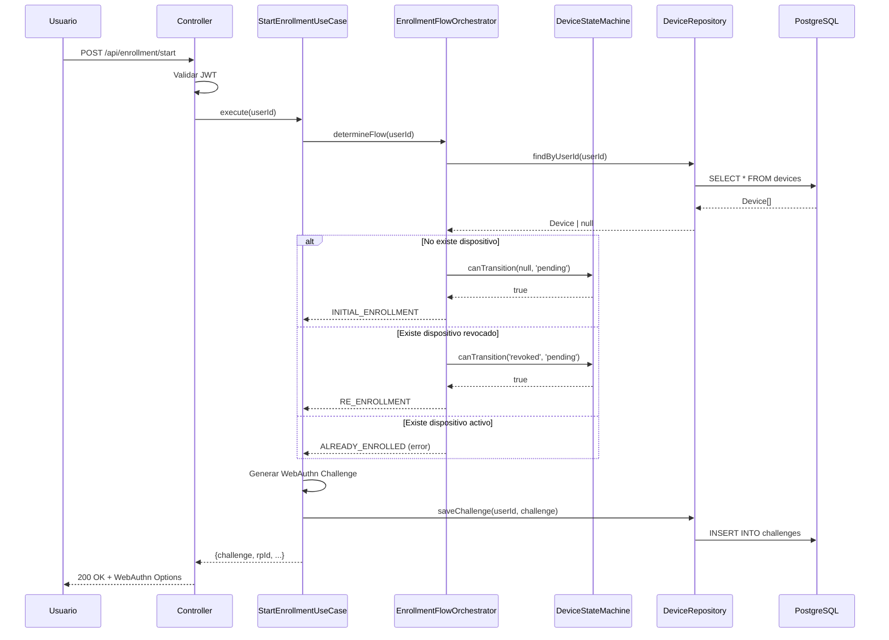
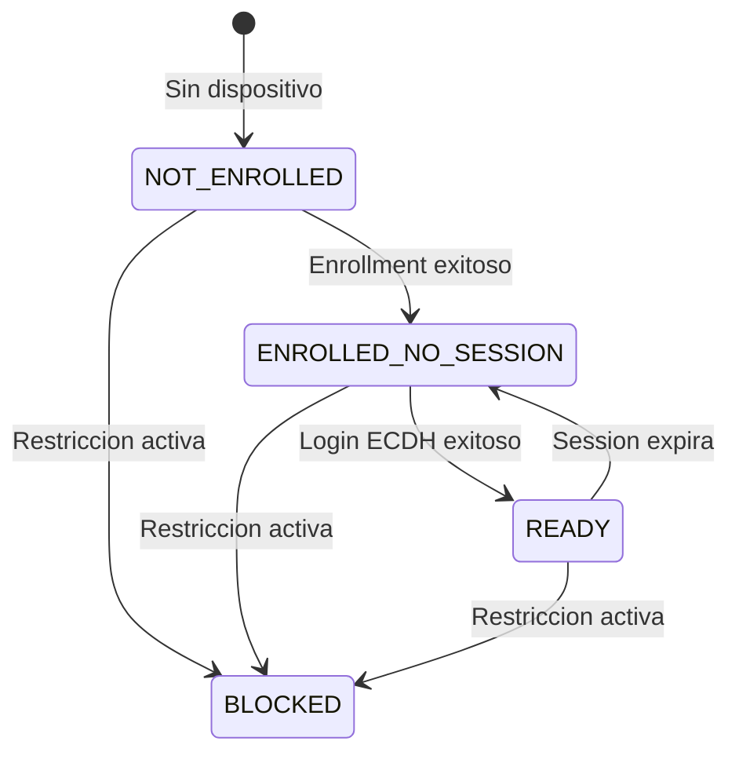
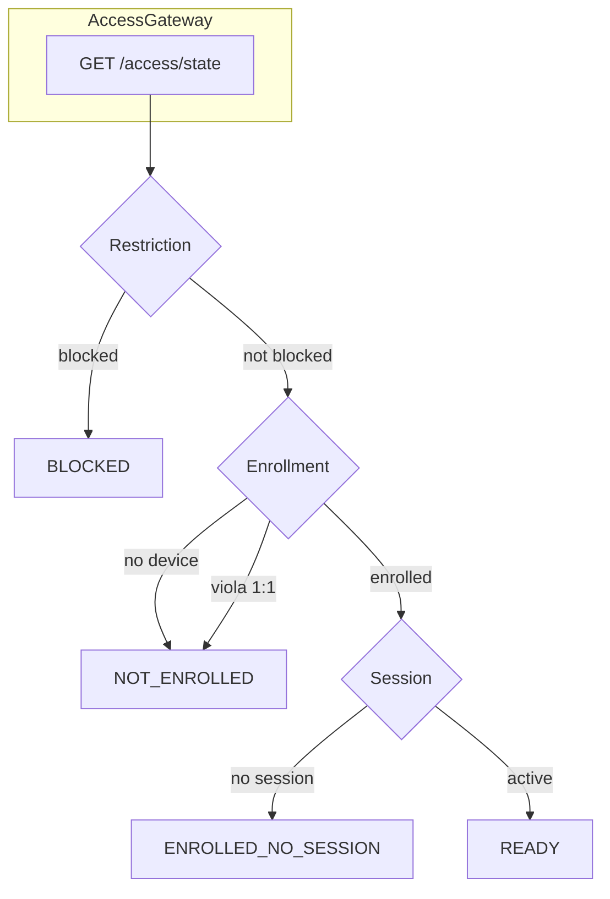
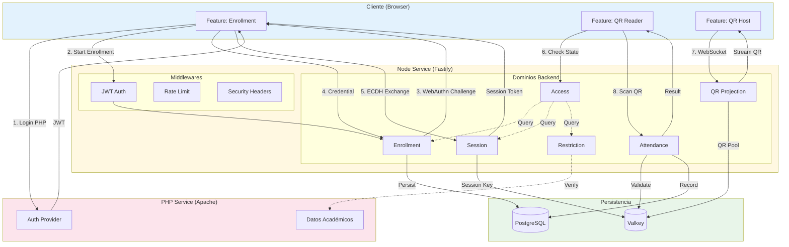

# Informe Técnico: Sistema de Asistencia

> Documento de caracterización arquitectónica para onboarding de nuevos integrantes del equipo.

---

## 1. Resumen Ejecutivo

El **Sistema de Asistencia** es una aplicación web que permite registrar la asistencia de estudiantes mediante códigos QR dinámicos y autenticación biométrica FIDO2. Está diseñado como un **Monolito Modular con Vertical Slicing**, priorizando mantenibilidad, seguridad y testabilidad.

- **Monolito**: Una sola aplicación desplegable
- **Modular**: Código organizado en módulos autocontenidos
- **Vertical Slicing**: Estructura por características de negocio
---

## 2. Características Arquitectónicas

### 2.1 Patrón Principal: Monolito Modular con Vertical Slicing

| Característica | Descripción | Justificación |
|----------------|-------------|---------------|
| **Monolito** | Una sola unidad desplegable | Simplicidad operacional, sin overhead de microservicios |
| **Modular** | Dominios autónomos y desacoplados | Facilita testing, refactoring y evolución independiente |
| **Vertical Slicing** | Cada módulo contiene todas sus capas | Evita dependencias cruzadas horizontales |

### 2.2 Principios de Diseño

1. **Separación de Concerns por Dominio**: Cada funcionalidad de negocio está encapsulada en su propio módulo.
2. **Flujo de Dependencias Unidireccional**: Las capas superiores dependen de las inferiores, nunca al revés.
3. **Inversión de Dependencias**: Se usan interfaces (puertos) para desacoplar la lógica de negocio de la infraestructura.
4. **Single Source of Truth**: Configuración centralizada, sin duplicación de constantes.

**Topología resultante del Vertical Slicing:**

```bash
src/backend/
├── enrollment/                    # DOMINIO: Registro de dispositivos
│   ├── domain/                    #   └─ Reglas de negocio puras
│   │   ├── models.ts              #       ├─ Entidades y Value Objects
│   │   ├── services/              #       └─ Servicios de dominio
│   │   └── state-machines/        #           └─ Máquinas de estado
│   ├── application/               #   └─ Casos de uso
│   │   ├── use-cases/             #       ├─ StartEnrollmentUseCase
│   │   └── orchestrators/         #       └─ EnrollmentFlowOrchestrator
│   ├── infrastructure/            #   └─ Implementaciones técnicas
│   │   ├── repositories/          #       ├─ DeviceRepository (PostgreSQL)
│   │   └── services/              #       └─ Fido2Service, EcdhService
│   └── presentation/              #   └─ Capa HTTP
│       ├── controllers/           #       ├─ Handlers de endpoints
│       ├── routes.ts              #       └─ Registro de rutas
│       └── validation-schemas.ts  #           └─ Validación de inputs
│
├── session/                       # DOMINIO: Gestión de sesiones ECDH
│   ├── domain/                    #   (misma estructura interna)
│   ├── application/
│   ├── infrastructure/
│   └── presentation/
│
├── attendance/                    # DOMINIO: Registro de asistencia
│   └── ...                        #   (misma estructura interna)
│
├── qr-projection/                 # DOMINIO: Emisión de QR
│   └── ...
│
├── access/                        # DOMINIO: Gateway de estado
│   └── ...
│
└── restriction/                   # DOMINIO: Verificación de bloqueos
    └── ...
```

> Cada dominio es **autocontenido**: tiene sus propias capas y no importa código interno de otros dominios. La comunicación entre dominios ocurre solo a través de interfaces públicas (`index.ts`).

### 2.3 Beneficios Obtenidos

- **Testabilidad**: Cada módulo se prueba en aislamiento
- **Mantenibilidad**: Cambios en un dominio no afectan otros
- **Escalabilidad de Equipo**: Diferentes desarrolladores pueden trabajar en módulos distintos
- **Seguridad**: Superficie de ataque reducida por encapsulamiento

---

## 3. Stack Tecnológico

### 3.1 Backend

| Componente | Tecnología | Versión | Propósito |
|------------|------------|---------|-----------|
| Runtime | Node.js | 20 LTS | Entorno de ejecución JavaScript |
| Framework | Fastify | 4.28.1 | Servidor HTTP de alto rendimiento |
| Lenguaje | TypeScript | 5.5.4 | Tipado estático, seguridad en desarrollo |
| WebSocket | @fastify/websocket | 10.0.1 | Comunicación bidireccional (QR streaming) |
| WebAuthn | @simplewebauthn/server | 11.0.0 | Autenticación biométrica FIDO2 |
| JWT | jsonwebtoken | 9.0.2 | Validación de tokens de sesión |

### 3.2 Frontend

| Componente | Tecnología | Versión | Propósito |
|------------|------------|---------|-----------|
| Bundler | Vite | 6.0.1 | Build y HMR para desarrollo |
| WebAuthn | @simplewebauthn/browser | 11.0.0 | API de autenticación biométrica |
| QR Scanner | @zxing/library | 0.21.0 | Lectura de códigos QR desde cámara |
| QR Generator | qrcode | 1.5.3 | Generación de códigos QR |

### 3.3 Persistencia

| Componente | Tecnología | Versión | Propósito |
|------------|------------|---------|-----------|
| Base de Datos | PostgreSQL | 18 | Almacenamiento relacional principal |
| Cache/Sesiones | Valkey | 7 | Cache distribuido (compatible Redis) |
| Driver SQL | pg | 8.13.1 | Conexión a PostgreSQL |
| Driver Cache | ioredis | 5.4.1 | Conexión a Valkey |

### 3.4 Infraestructura

| Componente | Tecnología | Propósito |
|------------|------------|-----------|
| Contenedores | Podman | Aislamiento y despliegue |
| Orquestación | Podman Compose | Gestión multi-contenedor |
| Testing | Vitest | 2.1.8 | Tests unitarios e integración |

### 3.5 Justificación del Stack

- **Fastify sobre Express**: 2-3x más rápido, mejor soporte para TypeScript y WebSocket nativo
- **PostgreSQL**: Soporte para JSON, extensiones criptográficas, transacciones ACID
- **Valkey sobre Redis**: Fork open-source sin licencia restrictiva
- **TypeScript strict**: Previene errores en tiempo de compilación, documenta contratos
- **FIDO2/WebAuthn**: Estándar de autenticación sin contraseñas, resistente a phishing

---

## 4. Dominios del Sistema

### 4.1 Qué son los Dominios

En un **Monolito Modular**, cada **dominio** representa una capacidad de negocio autónoma. Contiene toda la lógica necesaria para su funcionamiento: desde la interfaz HTTP hasta la persistencia.

```
dominio/
├── domain/          # Reglas de negocio puras
├── application/     # Casos de uso y orquestación
├── infrastructure/  # Acceso a datos y servicios externos
└── presentation/    # Controladores HTTP/WebSocket
```

### 4.2 Dominios Backend

| Dominio | Responsabilidad | Capa Principal |
|---------|-----------------|----------------|
| **Enrollment** | Registro de dispositivos FIDO2, política 1:1 | Seguridad |
| **Session** | Intercambio ECDH, gestión de claves de sesión | Seguridad |
| **Access** | Agregación de estado (read-only), gateway de consulta | Consulta |
| **Attendance** | Validación de QR escaneados, registro de asistencia | Core |
| **QR Projection** | Generación y emisión de QR via WebSocket | Core |
| **Restriction** | Verificación de bloqueos (integración PHP) | Reglas |

### 4.3 Dominios Frontend (Features)

| Feature | Responsabilidad |
|---------|-----------------|
| **enrollment** | UI de registro biométrico y login ECDH |
| **qr-reader** | Escáner de QR para marcar asistencia |
| **qr-host** | Proyector de códigos QR en pantalla |

### 4.4 Para qué Sirve cada Dominio

```
┌─────────────────────────────────────────────────────────────┐
│                    FLUJO DE USUARIO                         │
├─────────────────────────────────────────────────────────────┤
│                                                             │
│  [Estudiante]                      [Profesor/Proyector]     │
│       │                                   │                 │
│       ▼                                   ▼                 │
│  ┌──────────┐                      ┌──────────────┐         │
│  │Enrollment│ ◄── Registra ──────► │              │         │
│  │          │     dispositivo      │              │         │
│  └────┬─────┘                      │              │         │
│       │                            │QR Projection │         │
│       ▼                            │              │         │
│  ┌──────────┐                      │              │         │
│  │ Session  │ ◄── Inicia sesión    │              │         │
│  │          │     (ECDH)           └──────┬───────┘         │
│  └────┬─────┘                             │                 │
│       │                                   │ Emite QR        │
│       ▼                                   ▼                 │
│  ┌──────────┐                      ┌──────────────┐         │
│  │  Access  │ ◄── Consulta ──────► │  Attendance  │         │
│  │ (estado) │     disponibilidad   │  (registro)  │         │
│  └──────────┘                      └──────────────┘         │
│                                                             │
└─────────────────────────────────────────────────────────────┘
```

---

## 5. Patrón de Diseño Especial: Clean Architecture con Use Cases

### 5.1 Identificación del Patrón

El sistema implementa **Clean Architecture** con las siguientes características:

- **Use Cases**: Cada acción del usuario tiene una clase dedicada
- **State Machines**: Gestión de transiciones de estado válidas
- **Repositories**: Abstracción del acceso a datos
- **Orchestrators**: Coordinación de flujos complejos

### 5.2 Componentes del Patrón

| Componente | Ubicación | Responsabilidad |
|------------|-----------|-----------------|
| **Use Case** | `application/use-cases/` | Ejecutar una acción específica del usuario |
| **State Machine** | `domain/state-machines/` | Validar transiciones de estado |
| **Repository** | `infrastructure/repositories/` | CRUD sobre entidades |
| **Orchestrator** | `application/orchestrators/` | Coordinar múltiples use cases |
| **Controller** | `presentation/controllers/` | Recibir HTTP, invocar use case, retornar respuesta |

### 5.3 Flujo de un Use Case



### 5.4 Ejemplo Concreto: Enrollment Flow



### 5.5 State Machine: Estados del Sistema (Access Gateway)



**Estados Agregados del Sistema:**

| Estado | Descripción | Acción Frontend |
|--------|-------------|-----------------|
| `NOT_ENROLLED` | Usuario sin dispositivo activo | Redirigir a enrollment |
| `ENROLLED_NO_SESSION` | Tiene dispositivo pero sin session_key | Iniciar login ECDH |
| `READY` | Listo para operar | Habilitar lector QR |
| `BLOCKED` | Restricción activa (override) | Mostrar mensaje de bloqueo |

**Flujo de Evaluación (Access Gateway):**



---

## 6. Diagrama de Flujo E2E del Sistema



### 6.1 Flujo Resumido

1. **Autenticación**: Usuario se autentica en PHP, recibe JWT
2. **Enrollment**: Registra dispositivo FIDO2 (una sola vez)
3. **Session**: Establece sesión ECDH cada vez que inicia la app
4. **Access Check**: Verifica estado antes de operar
5. **QR Projection**: Profesor proyecta QR dinámicos via WebSocket
6. **Attendance**: Estudiante escanea QR, se registra asistencia

---

## 7. Estructura de Archivos

```
Asistencia/
├── node-service/
│   ├── src/
│   │   ├── backend/
│   │   │   ├── enrollment/      # Dominio: Registro FIDO2
│   │   │   ├── session/         # Dominio: Sesiones ECDH
│   │   │   ├── access/          # Dominio: Gateway de estado
│   │   │   ├── attendance/      # Dominio: Registro asistencia
│   │   │   ├── qr-projection/   # Dominio: Emisión QR
│   │   │   └── restriction/     # Dominio: Bloqueos
│   │   ├── frontend/
│   │   │   └── features/        # UI por funcionalidad
│   │   ├── shared/              # Infraestructura compartida
│   │   └── middleware/          # Middlewares globales
│   └── package.json
├── php-service/                 # Servicio PHP legacy
├── database/
│   └── migrations/              # Migraciones SQL
└── compose.yaml                 # Orquestación de servicios
```

---

## 8. Glosario

### Conceptos Arquitectónicos

- **Vertical Slicing**: Organización donde cada feature/dominio contiene todas sus capas (domain, application, infrastructure, presentation) en lugar de separar por capas técnicas horizontales.
- **Use Case**: Clase que encapsula una acción específica del usuario. Recibe input, ejecuta lógica de negocio y retorna output.
- **State Machine**: Componente que define y valida las transiciones de estado permitidas de una entidad.
- **Repository**: Abstracción sobre el acceso a datos que oculta los detalles de persistencia (PostgreSQL, Valkey).
- **Orchestrator**: Componente que coordina múltiples servicios o use cases para completar un flujo complejo.

### Tecnologías

- **FIDO2/WebAuthn**: Estándar W3C de autenticación sin contraseña usando biometría o llaves de seguridad. Permite probar posesión de una clave privada sin transmitirla.
- **ECDH** (Elliptic Curve Diffie-Hellman): Protocolo criptográfico de intercambio de claves que permite a dos partes derivar un secreto compartido sin transmitirlo.
- **HKDF** (HMAC-based Key Derivation Function): Función para derivar claves criptográficas a partir de material de entrada (ej: shared_secret → session_key).
- **AES-256-GCM**: Algoritmo de cifrado simétrico usado para encriptar los payloads de los QR.
- **Valkey**: Fork open-source de Redis, usado como cache y almacén de sesiones efímeras.

### Variables del Payload QR

- **AAGUID** (Authenticator Attestation GUID): Identificador único del modelo de autenticador FIDO2. Permite validar que el dispositivo es de un tipo autorizado (ej: Windows Hello, iCloud Keychain) y rechazar emuladores.
- **TOTPu** (Time-based OTP del Usuario): Código temporal derivado de `session_key` usando RFC 6238. Cambia cada 30 segundos y sirve como validación anti-replay. Ambos lados (cliente/servidor) lo calculan independientemente.
- **session_key**: Clave simétrica efímera derivada del handshake ECDH. Se usa para cifrar/descifrar los payloads QR. Almacenada en Valkey con TTL de 2 horas.
- **handshake_secret**: Clave persistente derivada con HKDF durante el enrollment. Se almacena en PostgreSQL y se usa como base para derivar la session_key.
- **credentialId**: Identificador único de la credencial WebAuthn (Base64URL). Generado por el autenticador durante enrollment.
- **deviceFingerprint**: Hash de propiedades del navegador/dispositivo. Usado para validar la política 1:1 (mismo dispositivo físico).
- **round**: Número de ciclo de validación (1 a N, default 3). El estudiante debe completar todos los rounds para registrar asistencia.
- **uid**: ID del usuario (RUT) incluido en el payload cifrado. Se valida contra el JWT para verificar propiedad.

### Estados del Sistema

- **NOT_ENROLLED**: Usuario sin dispositivo FIDO2 registrado. Acción: iniciar enrollment.
- **ENROLLED_NO_SESSION**: Dispositivo registrado pero sin session_key activa. Acción: iniciar login ECDH.
- **READY**: Sesión activa, usuario puede escanear QRs. Acción: habilitar lector.
- **BLOCKED**: Restricción activa (sanción, suspensión). Sin acción disponible.

---

*Documento generado para onboarding técnico - Proyecto Capstone02*
