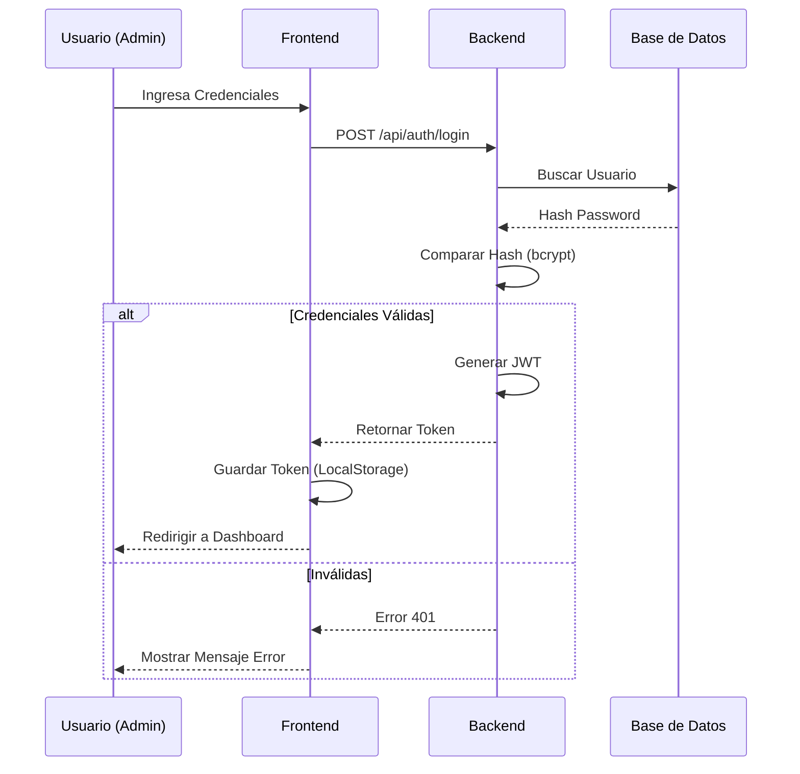
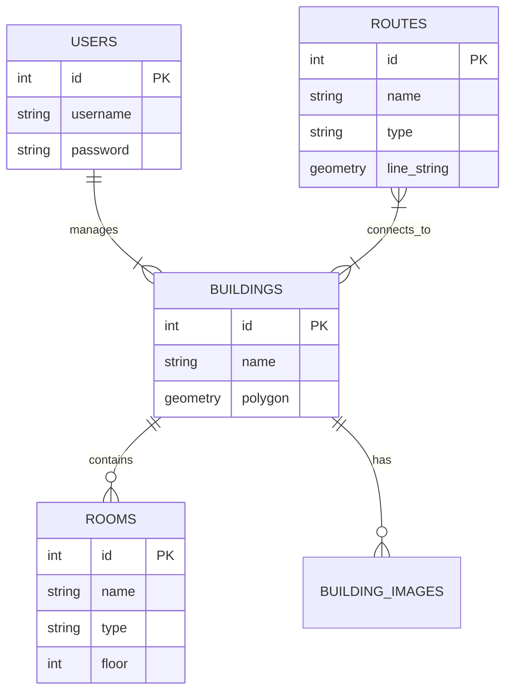

# 📊 Diagramas del Sistema

Este documento contiene la representación visual de la arquitectura, flujos de datos y estructura de base de datos.

## 🏗️ Arquitectura General

```mermaid
graph TD
    Client[Usuario Web / PWA]
    LB[Nginx Proxy / Load Balancer]
    API[Backend API (Node.js)]
    DB[(PostgreSQL + PostGIS)]
    Cache[Memory Cache]
    FS[File System (Imágenes)]

    Client -->|HTTPS / JSON| LB
    LB -->|Static Files| Client
    LB -->|/api Request| API
    API -->|SQL Queries| DB
    API -->|Read/Write| FS
    API -->|Internal| Cache
```

## 🔄 Flujo de Autenticación (JWT)



## 🛣️ Flujo de Cálculo de Ruta

```mermaid
flowchart LR
    A[Inicio] --> B{Validar Datos}
    B -->|Inválido| C[Error 400]
    B -->|Válido| D[Obtener Todas las Rutas]
    D --> E[Construir Grafo en Memoria]
    E --> F[Filtrar por Tipo (Peatonal/Accesible)]
    F --> G[Encontrar Nodos más Cercanos (Start/End)]
    G --> H[Ejecutar Dijkstra]
    H --> I{¿Camino Encontrado?}
    I -->|No| J[Error 404]
    I -->|Si| K[Combinar Geometría (LineString)]
    K --> L[Retornar GeoJSON + Meta]
```

## 🗄️ Modelo Relacional (ER)


